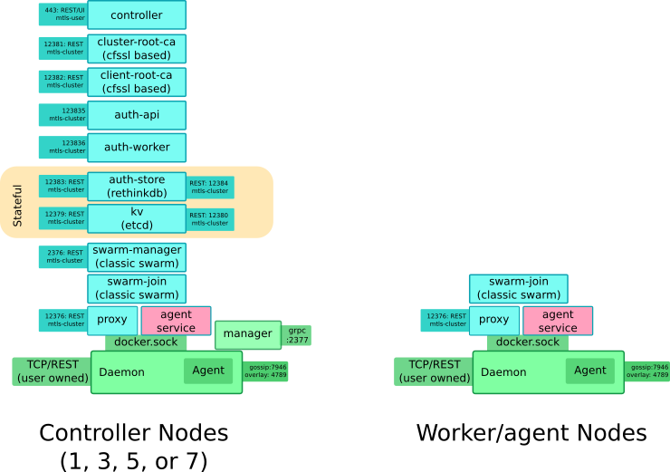

# UCP Seattle Release Plan

This document provides an overview of the upcoming UCP release that
aligns with DockerCon US 2016, codenamed "UCP Seattle."


## Overview

The primary focus for this release is adapting to and exposing the new
capabilities of the 1.12 engine release, which embeds clustering directly
within the core platform.  Additional UCP specific feature enhancements
will be picked up opportunistically as schedule permits.

Generally speaking, the set of containers, and the logical structure of
UCP will remain the same.

With clustering built directly into the core platform, our goal is to
mirror the core platform cluster membership methodology as closely
as possible.  For example, instead of running the UCP bootstrapper
tool to "join" a node, you will instead run `docker cluster join ...`
to expand your UCP cluster, just as you would on a non-UCP (opensource)
1.12 cluster.  UCP will be "wired in" to the flows where appropriate so
we can offer enterprise centric controls and management of these flows.




## (New) Terminology

* **Manager** - Much like swarm v1, this node will perform cluster level scheduling decisions.
    * Unlike v1, no KV store is required, and all cluster state is tracked by a built-in raft/gossip implementation.
    * We will continue to map UCP Controllers to Mangers 1:1
* **Agent** - A non-manager node in the cluster that provides additional capacity.  We'll adopt this terminology to be consistent with 1.12/swarmv2.

## Backwards Compatibility

Enterprise customers have an expectation that once they deploy
a commercial product into production, any internal processes and
integrations they set up against that product will remain functional
over an extended period of time, and their investment in the product is
amortized over this time-frame, thus helping justify the higher cost of
the software.  While the swarm/core team can (and should) operate under
opensource philosophy of rapid innovation without significant concern to
backwards compatibility, we do not have that luxury.  UI workflows will
be shifted to the new application based model, but API/CLI consumption
is scripted, and must support backwards compatibility.

Backwards compatibility will be achieved by running both Swarm V1
and the new 1.12 clustering (aka, Swarm V2) on the same set of nodes.
See the Bootstrapping below for more details.

Our plan is to phase out the legacy API over a series of releases.  Exact
timing is TBD - Before shipping this release we must pin the timing down
so it can be communicated to customers.

1. Backwards compatibility enabled by default, and identified as
deprecated.  It will be fully supported, but will be removed in a
future release.  Customers should develop any new workloads using the
new API/CLI tools, and should plan to migrate their existing workloads
over to the new APIs during the deprecation window.

2. Most likely +1 release - Backwards compatibility disabled by default,
but can be enabled by admins. (if that makes sense...)

3. Most likely 1 year after (1) Backwards compatibility removed and
no longer supported.  All workloads must be migrated before deploying
this release.

## Non-UCP 1.12 bootstrapping (for reference)

In 1.12, clustering in the OSS product is designed to be very simple/easy
to set up.  The sequence goes something like this

1. User runs `docker cluster init` on one engine
    * The engine creates a root CA, and initializes the cluster
2. The user runs `docker cluster join` on another engine, pointing at the first.  They specify if they want this node to be an agent or a manager
    * A CSR is sent to the cluster, which is an async task
    * The user then runs `docker cluster accept ...` to grant access
        * Manages most likely require accepting, agents may be allowed to join automatically
    * Once granted, the CSR task "completes" and the new node gets certs that can be used to join the cluster
3. Periodically the node will automatically renew its certs
    * The CA will auto-accept renewals based on mtls of the request, and keep the CN the same
4. The admin may remove nodes (updates a blacklist with their cert's CN)
    * The blacklist is implemented in the manager based on CNs

* Note: swarm requires all nodes must be on the same L3 network as the managers, or it doesn't work.  There can't be NAT in the mix - bi-directional addressability must work
    * By default, the agent nodes advertise address is auto-determined based on the interface used to talk to the manager, but there will (most likely) be provisions for users to forceably set this - we should respect whatever setting swarmv2 is using

The exact UX of this is still undergoing some churn. See the following issue for more details

* https://github.com/docker/swarm-v2/issues/544


## Features and Components

The following lists the major features and components that make up this
release, and links to documents that go into more details.  We'll use
an agile development model and focus on the phase 1 components first.
Once those are stable, we'll proceed to address as many phase 2
components as we can up to the point we decide to cut the release.

While sequencing the development work, we'll initially focus on new
application centric features first in order to provide the most compelling
demo at DockerCon.  The secondary focus is backwards compatibility,
which will be required for GA of UCP, but not a hard requirement for
DockerCon itself.  Once those are done, then engineers will roll onto
the phase2 projects if we have time prior to a GA (or phase 2 projects
will fall to a subsequent release.)


* Phase 1 - P0 Components:
   * [API/Applications](./seattle/api.md)
   * [UI](./seattle/ui.md)
   * [CA](./seattle/ca.md)
   * [Bootstrapper](./seattle/bootstrap.md)
   * [Proxy](./seattle/proxy.md)
   * [Nodes](./seattle/nodes.md)
   * [Windows](./seattle/windows.md) Technically a P1, but comes for ~free
   * [Upgrade](./seattle/upgrade.md)
* Phase 2 - P1 Components:
   * [Load Balancing](./seattle/lb.md)
   * [Service Discovery](./seattle/sd.md)
   * [SAML](./seattle/saml.md)
   * [Secrets](./seattle/secrets.md)
   * [Historical Data](./seattle/history.md)

* Future:
   * Take over an existing swarm cluster (preserving membership)
   * Federation (in the queue for ~September) - same CA, so same logical cluster, but with multiple "regions"
        * 3,5, or 7 managers per region
        * API requests go cross-region
   * First-class OSS CLI for CSR - generating a client cert without passing private key over the wire

## Getting Started

### Using AWS Editions and official builds on hub:

1. Install using the edition instructions:
    * https://github.com/docker/editions.aws/releases/tag/TP6
2. Open up the Manager portgroup to allow port 443 inbound
3. SSH into one of the Managers - this will be the **only** UCP controller for now (until we get HA fully wired up for 1.12)
4. Load up the required images:
    ```
    docker login

    for i in $(docker run --rm dockerorcadev/ucp:1.2.0-latest images --list --image-version dev: ) ; do docker pull $i; done
    ```
5. Install UCP on this node: (Replace the SAN entries with the external hostname/IP of the AWS node you'r installing on)
    ```
    docker run --rm -it \
        --name ucp \
        -v /var/run/docker.sock:/var/run/docker.sock \
        dockerorcadev/ucp:1.2.0-latest \
        install --image-version dev: \
        --san ec2-52-37-191-68.us-west-2.compute.amazonaws.com --san 52.37.191.68 --swarm-port 3376

    ```
6. Point your browser to `https://$YOURPUBIP/` and login to UCP
7. **WARNING** the security groups are closed by default, so you'll have to open up ports for any services you try to expose to the outside world.

### Deploying it locally using developer builds

This will undoubtedly be stale as soon as it's written, but anyway...

* Get a VM running with 1.12 (don't upgrade your dev box...)  Use the following if you use KVM
    * B2D based (KVM, virtualbox, others...)
        * Pre-built:
            * https://jenkins-orca.dockerproject.com/job/boot2docker/lastSuccessfulBuild/artifact/boot2docker.iso
            * `docker-machine create -d ${MACHINE_DRIVER} --${MACHINE_DRIVER}-boot2docker-url file:///home/jdoe/boot2docker-1.12-tp0.iso tp0-docker12-vm`
        * Build-your-own:
            * TP0: https://github.com/docker/docker-1.12-integration/releases/download/TP0/docker-1.12.0-dev.tgz
            * Nightly: https://jenkins-orca.dockerproject.com/job/docker-engine/lastSuccessfulBuild/artifact/bundles/latest/tgz/linux/amd64/docker-1.12.0-dev.tgz
            * https://github.com/dhiltgen/customb2d
                * Modify the `build.sh` script so it doesn't download any specific version, but uses the one already in the dir
    * AWS based VMs:
        * TBD...

* Add the new docker-1.12 binary someplace in your path - I recommend calling it `docker-1.12.0-tp0`
    * TP0: https://github.com/docker/docker-1.12-integration/releases/download/TP0/docker-1.12.0-dev.tgz
    * Nightly: https://jenkins-orca.dockerproject.com/job/docker-engine/lastSuccessfulBuild/artifact/bundles/latest/tgz/linux/amd64/docker-1.12.0-dev.tgz

* Initialize the cluster - On your first VM

    ```bash
eval $(docker-machine env node0)
docker run --rm -it --name ucp -v /var/run/docker.sock:/var/run/docker.sock \
        docker/ucp:1.2.0-dev \
        install --swarm-port 3376
```
* Join a worker node - On your second VM (replace the IP with the IP of your first controller)

    ```bash
eval $(docker-machine env node1)
docker-1.12.0-tp0 swarm join 192.168.42.142:4500
docker run --rm -it --name ucp -v /var/run/docker.sock:/var/run/docker.sock \
        docker/ucp:1.2.0-dev \
        join --url https://192.168.42.142:443 -i
```
