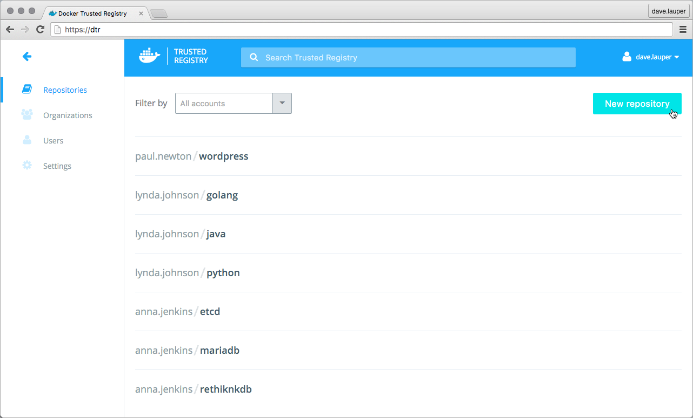
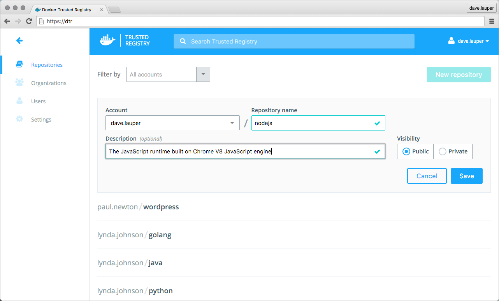

<!--[metadata]>
+++
aliases = ["/docker-trusted-registry/userguide/"]
title = "Create a repository"
description = "Learn how to manage your repositories on Docker Trusted Registry."
keywords = ["docker, registry, management, repository"]
[menu.main]
parent="dtr_menu_repos_and_images"
identifier="dtr_create_repo"
weight=0
+++
<![end-metadata]-->

## Create a repository

Before you can push images to your Docker Trusted Registry, you need to
create a repository for them.

To create a new repository, navigate to the **DTR web application**, and click
the **New repository** button.

Add a **name and description** for the repository, and choose whether your
repository is public or private:

  * Public repositories are visible to all users, but can only be changed by
  users granted with permission to write them.
  * Private repositories can only be seen by users that have been granted
  permissions to that repository.

Click **Save** to create the repository. Now you can push your images to this
repository.

## Where to go next

* [Push and pull images](push-and-pull-images.md)
* [Delete images](delete-images.md)
