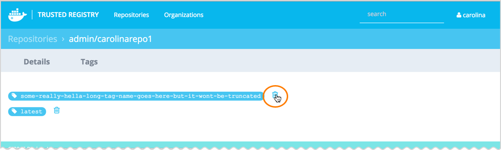

<!--[metadata]>
+++
aliases = ["/docker-trusted-registry/soft-garbage/"]
title = "Delete images"
description = "Learn how to delete images from your repositories on Docker Trusted Registry."
keywords = ["docker, registry, management, repository, delete, image"]
[menu.main]
parent="dtr_menu_repos_and_images"
weight=20
+++
<![end-metadata]-->


# Delete images

This document describes the two-step process of removing an image from the
Trusted Registry. This process is first performed by developers wanting to
remove their images and marking them for deletion. Then, an administrator
removes those images mainly through a recurring garbage collection job.

## Understand the role of images and manifests in image deletion

Manifests are a type of file that describe images. They reference a list of
layers and hold metadata about the described image. Manifests can also share
layers. Tags, which are labels applied to images, point to manifests. You can
reference an image by tag or directly by the hash of the manifest. If you
purposefully delete one of those manifests and the image layers referenced by
that manifest become orphaned, then they can be removed during the garbage
collection job. In the following diagram, _both_ manifests point to the first layer, #2543d8.


Since many developers may use a base image for future images, it is possible
that there will be image layers that will  never be deleted. There might be other
manifests that point to layers of the base image which could still be used by
others as seen in the second diagram.


## Prerequisites
You need an image to remove.

## Soft delete an image

Developers may want to remove an image for several reasons.
Examples include:

* The image is outdated and there is a new version.
* The image is no longer used.

If a developer removes the manifest of an image, then it is called a soft
deletion. Developers won't be able to access that image, although physically, it
it still in the repository.

You can perform a soft deletion, either from the UI or from the command line.

From the Trusted Registry dashboard, navigate to Repositories > Tags. Click the trash can next to the images you want to remove. They are now marked for the garbage collection job.




If you prefer to not use the UI, then you can open a Trusted Registry command line and type:

```bash
$ curl -u <username>:<password> -X DELETE https://<DTR HOST>/api/v0/repositories/<namespace>/<reponame>/manifests/<reference>
```

You can only delete one image at a time and you must also be authenticated as a
user who has "write" level access to the repository.

## Set up garbage collection

Trusted Registry administrators can optimize registry storage and free up space.
They do this by setting up a recurring garbage collection job (cron job) where
the system searches for any layers that are not referenced by any manifests and
removes them. Administrators can perform this garbage collection process
immediately, or more realistically, on a periodic automatic schedule.
They perform garbage collection of unreferenced layers tags either
through a Trusted Registry CLI or through the Trusted Registry UI.

If administrators choose to have the garbage collection process performed
immediately, they can type in a Trusted Registry CLI:

    curl -X POST -u <username>:<password> -H "Content-Type: application/json" "https://api/v0/admin/jobs" -d "{ \"job\" : \"registryGC\"}"

However, it is more common to set up the garbage collection cron job to be performed routinely as seen in the following example:

```bash
$ curl -u <username>:<password> -H 'Content-Type: application/json' -X POST https://<DTR
HOST>/api/v0/admin/settings/registry/garbageCollection/schedule -d '{"schedule":
"<schedule>"}'
```

Trusted Registry administrators can also set the cron job through the Trusted
Registry UI. Navigate to Settings > Garbage collection to schedule a job.

### A cron job example
A Trusted Registry cron format has **at most** four fields representing hour,
day, month, and day of week respectively. Moreover, administrators can use the
following shortcuts: `@yearly`, `@annually`, `@monthly`, `@weekly`, `@daily`,
`@midnight`, `@hourly` in either the UI or through the Trusted Registry CLI. If
administrators choose to use the shortcuts, then only one can be used.

An example schedule of nightly at midnight would be: `0 * * *`. Or alternately,
for the same schedule, you could enter: @midnight. You can also enter less than
four parameters if that's all the job requires.

See the [package cron page](https://godoc.org/github.com/robfig/cron) for other
examples depending on your company's requirements.

>**Note**: The prior link displays examples using more than four fields. When Trusted Registry administrators set up a cron schedule, they are limited to only the four fields representing hour, day, month, and day of week.

Your downtime depends on the number of images and/or layers that are to be
deleted. Docker recommends performing garbage collection weekly during off time.
While garbage collection is occurring, anyone who tries to push an image will
get an error message.

## View your garbage collection results

See your results by running the following example in a Trusted Registry CLI:

```bash
$ curl -u <username>:<password> https://<DTR
HOST>/api/v0/admin/settings/registry/garbageCollection/lastSavings
```

The results are also displayed in the Trusted Registry UI by navigating to Settings > Garbage collection.
