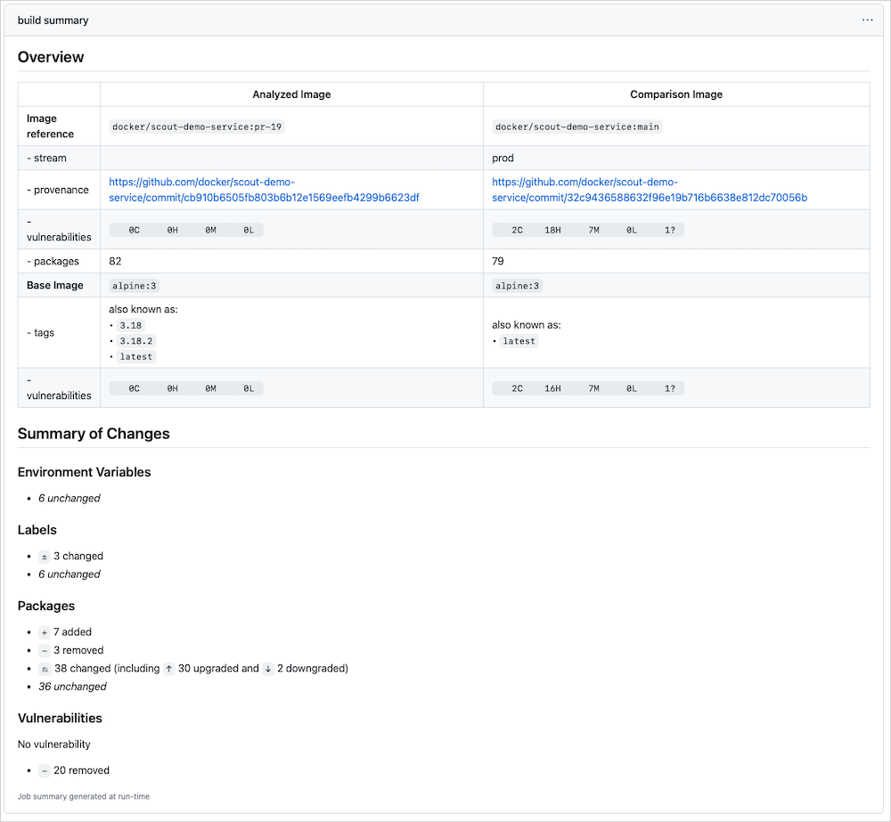



You can analyze Docker images in continuous integration pipelines as you build
them using a GitHub action or the Docker Scout CLI plugin.

## GitHub Actions

You can use [the Docker Scout GitHub action](https://github.com/docker/scout-action) to run Docker Scout CLI commands
as part of a workflow.

The following example works in a repository containing a Docker image's
definition and contents. Triggered by a pull request, the action builds the
image and uses Docker Scout to compare the new version to the current published
version.

First, set up the rest of the workflow. There's a lot that's not specific to
Docker Scout but needed to create the images to compare. For more details on
those actions and using GitHub Actions with Docker in general, see [the GitHub Actions documentation](../build/ci/github-actions/index.md).

Add the following to a GitHub Actions YAML file:


```yaml
name: Docker

on:
  push:
    tags: ["*"]
    branches:
      - "main"
  pull_request:
    branches: ["**"]

env:
  # Use docker.io for Docker Hub if empty
  REGISTRY: docker.io
  IMAGE_NAME: ${{ github.repository }}
  SHA: ${{ github.event.pull_request.head.sha || github.event.after }}

jobs:
  build:
    runs-on: ubuntu-latest
    permissions:
      contents: read
      packages: write
```


This sets up the workflow to run on pull requests and pushes to the `main`
branch, and sets up environment variables available to all workflow steps. It
then defines a job called `build` that runs on the latest Ubuntu image and sets
the permissions available to the job.

Add the following to the YAML file:


```yaml
steps:
  - name: Checkout repository
    uses: actions/checkout@v3
    with:
      ref: ${{ env.SHA }}

  - name: Setup Docker buildx
    uses: docker/setup-buildx-action@v2.5.0

  # Login against a Docker registry except on PR
  # https://github.com/docker/login-action
  - name: Log into registry ${{ env.REGISTRY }}
    uses: docker/login-action@v2.1.0
    with:
      registry: ${{ env.REGISTRY }}
      username: ${{ secrets.DOCKER_USER }}
      password: ${{ secrets.DOCKER_PAT }}

  # Extract metadata (tags, labels) for Docker
  # https://github.com/docker/metadata-action
  - name: Extract Docker metadata
    id: meta
    uses: docker/metadata-action@v4.4.0
    with:
      images: ${{ env.REGISTRY }}/${{ env.IMAGE_NAME }}
      labels: |
        org.opencontainers.image.revision=${{ env.SHA }}
      tags: |
        type=edge,branch=$repo.default_branch
        type=semver,pattern=v{{version}}
        type=sha,prefix=,suffix=,format=short
```


This creates workflow steps to checkout the repository, set up Docker buildx,
log into the Docker registry, and extract metadata from Git reference and GitHub
events to use in later steps.

Add the following to the YAML file:


```yaml
# Build and push Docker image with Buildx (don't push on PR)
# https://github.com/docker/build-push-action
- name: Build and push Docker image
  id: build-and-push
  uses: docker/build-push-action@v4.0.0
  with:
    context: .
    push: true
    tags: ${{ steps.meta.outputs.tags }}
    labels: ${{ steps.meta.outputs.labels }}
    cache-from: type=gha
    cache-to: type=gha,mode=max
```


This uses the extracted metadata from the previous step to build and push the
Docker image to Docker Hub. GitHub Actions skips this step on pull requests and
only runs when a pull request is merged.

Add the following to the YAML file:


```yaml
- name: Docker Scout
  id: docker-scout
  if: ${{ github.event_name == 'pull_request' }}
  uses: docker/scout-action@dd36f5b0295baffa006aa6623371f226cc03e506
  with:
    command: compare
    image: ${{ steps.meta.outputs.tags }}
    to: ${{ env.REGISTRY }}/${{ env.IMAGE_NAME }}:edge
    ignore-unchanged: true
    only-severities: critical,high
    token: ${{ secrets.DOCKER_PAT }}
```


This final step uses the Docker Scout CLI to run [the `compare` command](../engine/reference/commandline/scout_compare.md), comparing the new
image to the published one. It only shows critical or high-severity
vulnerabilities and ignores vulnerabilities that haven't changed since the last
analysis.

The GitHub Action outputs the comparison results as a table and a summary in the
action output.



## GitLab

The following examples runs in GitLab CI in a repository containing a Docker
image's definition and contents. Triggered by a commit, the pipeline builds the
image. If the commit was to the default branch, it uses Docker Scout to get a
CVE report. If the commit was to a different branch, it uses Docker Scout to
compare the new version to the current published version.

First, set up the rest of the workflow. There's a lot that's not specific to
Docker Scout but needed to create the images to compare.

Add the following to a _.gitlab-ci.yml_ file at the root of your repository.

```yaml
docker-build:
  image: docker:latest
  stage: build
  services:
    - docker:dind
  before_script:
    - docker login -u "$CI_REGISTRY_USER" -p "$CI_REGISTRY_PASSWORD" $CI_REGISTRY

    # Install curl and the Docker Scout CLI
    - |
      apk add --update curl
      curl -sSfL https://raw.githubusercontent.com/docker/scout-cli/main/install.sh | sh -s -- 
      apk del curl 
      rm -rf /var/cache/apk/*
    # Login to Docker Hub required for Docker Scout CLI
    - docker login -u "$DOCKER_HUB_USER" -p "$DOCKER_HUB_PAT"
```

This sets up the workflow to build Docker images with GitLab's
"Docker-in-Docker" mode to run Docker inside a container.

It then downloads curl and the Docker CLI and logs into the GitLab CI registry
and the Docker registry using environment variables defined in your repository's
settings.

Add the following to the YAML file:


```yaml
script:
  - |
    if [[ "$CI_COMMIT_BRANCH" == "$CI_DEFAULT_BRANCH" ]]; then
      tag=""
      echo "Running on default branch '$CI_DEFAULT_BRANCH': tag = 'latest'"
    else
      tag=":$CI_COMMIT_REF_SLUG"
      echo "Running on branch '$CI_COMMIT_BRANCH': tag = $tag"
    fi
  - docker build --pull -t "$CI_REGISTRY_IMAGE${tag}" .
  - |
    if [[ "$CI_COMMIT_BRANCH" == "$CI_DEFAULT_BRANCH" ]]; then
      # Get a CVE report for the built image and fail the pipeline when critical or high CVEs are detected
      docker scout cves "$CI_REGISTRY_IMAGE${tag}" --exit-code --only-severity critical,high    
    else
      # Compare image from branch with latest image from the default branch and fail if new critical or high CVEs are detected
      docker scout compare "$CI_REGISTRY_IMAGE${tag}" --to "$CI_REGISTRY_IMAGE:latest" --exit-code --only-severity critical,high --ignore-unchanged
    fi

  - docker push "$CI_REGISTRY_IMAGE${tag}"
```


This creates the flow mentioned previously. If the commit was to the default
branch, Docker Scout generates a CVE report. If the commit was to a different
branch, Docker Scout compares the new version to the current published version.
It only shows critical or high-severity vulnerabilities and ignores
vulnerabilities that haven't changed since the last analysis.

Add the following to the YAML file:

```yaml
rules:
  - if: $CI_COMMIT_BRANCH
    exists:
      - Dockerfile
```

These final lines ensure that the pipeline only runs if the commit contains a
Dockerfile and if the commit was to the CI branch.

_The following is a video walkthrough of the process of setting up the workflow with GitLab._

<div style="position: relative; padding-bottom: 64.86486486486486%; height: 0;"><iframe src="https://www.loom.com/embed/451336c4508c42189532108fc37b2560?sid=f912524b-276d-417d-b44a-c2d39719aa1a" frameborder="0" webkitallowfullscreen mozallowfullscreen allowfullscreen style="position: absolute; top: 0; left: 0; width: 100%; height: 100%;"></iframe></div>

## Microsoft Azure DevOps Pipelines

The following examples runs in an Azure DevOps-connected repository containing a
Docker image's definition and contents. Triggered by a commit to the main
branch, the pipeline builds the image and uses Docker Scout to create a CVE
report.

First, set up the rest of the workflow and set up the variables available to all
pipeline steps. Add the following to an _azure-pipelines.yml_ file:

```yaml
trigger:
  - main

resources:
  - repo: self

variables:
  tag: "$(Build.BuildId)"
  image: "vonwig/nodejs-service"
```

This sets up the workflow to use a particular container image for the
application and tag each new image build with the build ID.

Add the following to the YAML file:

```yaml
stages:
  - stage: Build
    displayName: Build image
    jobs:
      - job: Build
        displayName: Build
        pool:
          vmImage: ubuntu-latest
        steps:
          - task: Docker@2
            displayName: Build an image
            inputs:
              command: build
              dockerfile: "$(Build.SourcesDirectory)/Dockerfile"
              repository: $(image)
              tags: |
                $(tag)
          - task: CmdLine@2
            displayName: Find CVEs on image
            inputs:
              script: |
                # Install the Docker Scout CLI
                curl -sSfL https://raw.githubusercontent.com/docker/scout-cli/main/install.sh | sh -s --
                # Login to Docker Hub required for Docker Scout CLI
                docker login -u $(DOCKER_HUB_USER) -p $(DOCKER_HUB_PAT)
                # Get a CVE report for the built image and fail the pipeline when critical or high CVEs are detected
                docker scout cves $(image):$(tag) --exit-code --only-severity critical,high
```

This creates the flow mentioned previously. It builds and tags the image using
the checked-out Dockerfile, downloads the Docker Scout CLI, and then runs the
`cves` command against the new tag to generate a CVE report. It only shows
critical or high-severity vulnerabilities.

## CircleCI

The following examples runs when triggered in CircleCI. When triggered, it
checks out the "docker/scout-demo-service:latest" image and tag and then uses
Docker Scout to create a CVE report.

Add the following to a _.circleci/config.yml_ file.

First, set up the rest of the workflow. Add the following to the YAML file:

```yaml
version: 2.1

jobs:
  build:
    docker:
      - image: cimg/base:stable
    environment:
      IMAGE_TAG: docker/scout-demo-service:latest
```

This defines the container image the workflow uses and an environment variable
for the image.

Add the following to the YAML file to define the steps for the workflow:

```yaml
steps:
  # Checkout the repository files
  - checkout
  
  # Set up a separate Docker environment to run `docker` commands in
  - setup_remote_docker:
      version: 20.10.24

  # Install Docker Scout and login to Docker Hub
  - run:
      name: Install Docker Scout
      command: |
        env
        curl -sSfL https://raw.githubusercontent.com/docker/scout-cli/main/install.sh | sh -s -- -b /home/circleci/bin
        echo $DOCKER_HUB_PAT | docker login -u $DOCKER_HUB_USER --password-stdin

  # Build the Docker image
  - run:
      name: Build Docker image
      command: docker build -t $IMAGE_TAG .
  
  # Run Docker Scout          
  - run:
      name: Scan image for CVEs
      command: |
        docker-scout cves $IMAGE_TAG --exit-code --only-severity critical,high
```

This checks out the repository files and then sets up a separate Docker
environment to run commands in.

It installs Docker Scout, logs into Docker Hub, builds the Docker image, and
then runs Docker Scout to generate a CVE report. It only shows critical or
high-severity vulnerabilities.

Finally, add a name for the workflow and the workflow's jobs:

```yaml
workflows:
  build-docker-image:
    jobs:
      - build
```

## Jenkins

You can add the following stage and steps definition to a `Jenkinsfile` to run
Docker Scout as part of a Jenkins pipeline. The pipeline needs two secrets
defined to authenticate with Docker Hub: `DOCKER_HUB_USER` and `DOCKER_HUB_PAT`
It also needs an environment variable defined for the image and tag.

```groovy
…
stage('Analyze image') {
    steps {
        // Install Docker Scout
        sh 'curl -sSfL https://raw.githubusercontent.com/docker/scout-cli/main/install.sh | sh -s -- -b /usr/local/bin'
        
        // Log into Docker Hub
        sh 'echo $DOCKER_HUB_PAT | docker login -u $DOCKER_HUB_USER --password-stdin'

        // Analyze and fail on critical or high vulnerabilities
        sh 'docker-scout cves $IMAGE_TAG --exit-code --only-serverity critical,high'
    }
}
```

This installs Docker Scout, logs into Docker Hub, and then runs Docker Scout to
generate a CVE report for an image and tag. It only shows critical or
high-severity vulnerabilities.