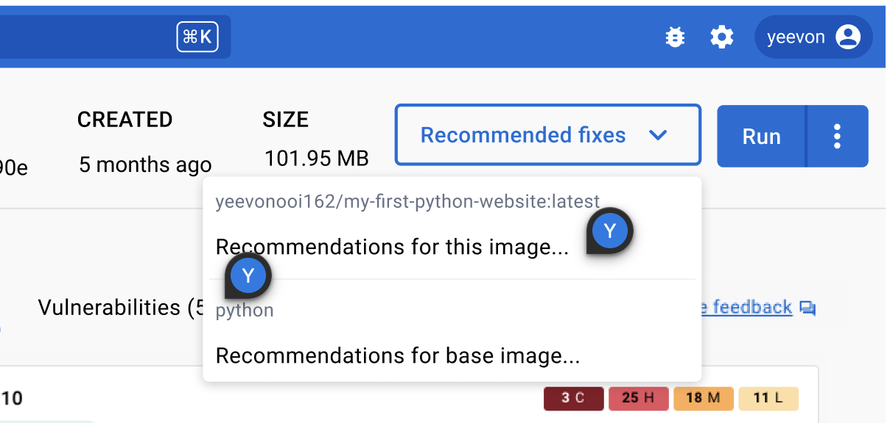

> **Note**
>
> Docker Scout is an [early access](../release-lifecycle.md#early-access-ea)
> product.

The image details view shows a breakdown of the Docker Scout analysis. You can
access the image view both from within Docker Desktop, and from the image tag
page on Docker Hub. This view provides a breakdown of the image hierarchy (base
images), image layers, packages, and vulnerabilities.

The image view lets you inspect the composition of an image from different
perspectives. The view displays vulnerabilities and packages that an image
contains. You can choose whether you want to see data for the image as a whole,
or for a specific base image or layer.

{:width="700px"}

## Image Hierarchy

The image you inspect may have one or more base images listed under **Image
hierarchy**. This means the author of the image used another image as a starting
point when building the image. Often these base images are either operating
system images such as Debian, Ubuntu, and Alpine, or programming language images
such as PHP, Python, and Java.

A base image may have its own parent base image so there is a chain of base
images represented in **Image hierarchy**. Selecting each image in the chain
lets you see which layers originate from each base image. Selecting the **ALL**
row reselects all the layers and base images for the entire image.

One or more of the base images may have updates available, which may include
updated security patches that remove vulnerabilities from your image. Any base
images with available updates are noted to the right of **Image hierarchy**.

## Layers

A Docker image consists of layers. Image layers are listed from top to bottom,
with the earliest layer at the top and the most recent layer at the bottom.
Often, the layers at the top of the list originate from a base image, and the
layers towards the bottom are layers added by the image author, often by adding
commands to a Dockerfile. To see which layers originate from a base image,
simply select a base image under **Image hierarchy** and the relevant layers are
highlighted.

Selecting individual or multiple layers filters the packages and vulnerabilities
on the right-hand side to see what has been added by the selected layers.

## Vulnerabilities

Images may be exposed to vulnerabilities and exploits. These are detected and
listed on the right-hand side, grouped by package, and sorted in order of
severity. Further information on whether the vulnerability has an available fix,
for example, can be examined by expanding the sections.

## Remediation

> Available in Docker Desktop 4.17 and later

In Docker Desktop, when inspecting an image, you can get recommended actions for
improving the security of your image.

To view the recommendations:

1. Go to the image details view for any image
2. Select the **Recommended fixes** dropdown.

From this dropdown menu, you can choose whether you want to see recommendations
for the current image or any base images used to build it.

{:width="700px"}

If the image you're viewing has no associated base images, only the option to
view recommendations for the current image displays here.

### Recommendations for current image

Selecting **Recommendations for this image** opens a window showing what you can
do to improve the security for the current image.

Currently, the only supported recommendation in this view is to update the image
version you're using, by pulling a newer version.

For example, if you are using an old or dangling version of a Postgres image,
this screen provides you with a suitable replacement tag that's newer and more
secure.

### Recommendations for base image

Selecting **Recommendations for base image** opens a window showing options for
the base image(s) used to build the current image. The window that displays
contains two tabs that you can toggle between. The tabs contain different types
of recommendations:

- Refresh base image
- Change base image

These base image recommendations are only actionable if you're the author of the
image you're inspecting. That's because changing the base image for an image
requires you to re-build the image and, in many cases, update the Dockerfile.

#### Refresh base image

This tab shows you if you if the selected base image tag is the latest available
version, or if it's outdated.

If the base image tag used to build the current image isn't the latest, then the
delta between the two versions shows in this window. The delta information
includes:

- The tag name, and aliases, of the recommended (newer) version
- The age of the current base image version
- The age of the latest available version
- The number of CVEs affecting each version

At the bottom of the window, you also receive command snippets that you can run
to re-build the image using the latest version.

#### Change base image

This tab can present you with different alternative tags that you can use, and
outlines the benefits and disadvantages of each tag version. Select base image
tag, and receive recommended options for that tag.

For example, selecting `python:3` as the current base image tag provides you
with a set of `python` image tags that would improve the security of the image.
By providing more than one alternative to choose from, you can see for yourself
how the options compare with each other, and decide which one to use.

{:width="700px"}

Select a tag recommendation to receive further details of the recommendation.
You'll see the benefits and potential disadvantages of this tag, why it's a
recommended, and how to update your Dockerfile to use this version.

