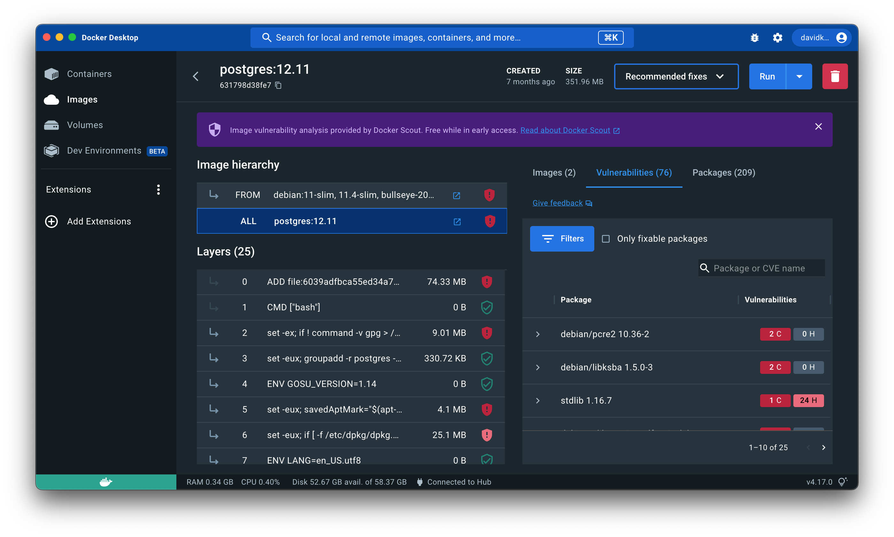



The image details view shows a breakdown of the Docker Scout analysis. You can
access the image view from within Docker Desktop and from the image tag
page on Docker Hub. The view provides a breakdown of the image hierarchy (base
images), image layers, packages, and vulnerabilities.

The image view lets you inspect the composition of an image from different
perspectives. The view displays vulnerabilities and packages that an image
contains. You can choose whether you want to see data for the image as a whole,
or for a specific base image or layer.

{:width="700px"}

## Image hierarchy

The image you inspect may have one or more base images represented under **Image hierarchy**.
This means the author of the image used other images as starting
points when building the image. Often these base images are either operating
system images such as Debian, Ubuntu, and Alpine, or programming language images
such as PHP, Python, and Java.

Selecting each image in the chain
lets you see which layers originate from each base image. Selecting the **ALL**
row reselects all the layers and base images for the entire image.

One or more of the base images may have updates available, which may include
updated security patches that remove vulnerabilities from your image. Any base
images with available updates are noted to the right of **Image hierarchy**.

## Layers

A Docker image consists of layers. Image layers are listed from top to bottom,
with the earliest layer at the top and the most recent layer at the bottom.
Often, the layers at the top of the list originate from a base image, and the
layers towards the bottom added by the image author, often using
commands in a Dockerfile. Selecting a base image under **Image hierarchy** 
highlights with layers originate from a base image.

Selecting individual or multiple layers filters the packages and vulnerabilities
on the right-hand side to show what the selected layers added.

## Vulnerabilities

The **Vulnerabilities** tab displays a list of vulnerabilities and exploits detected in the image. The list is grouped by package, and sorted in order of severity.

You can find further information on the vulnerability or exploit, including if a fix is available, by expanding the list item.

## Remediation recommendations

In Docker Hub and Docker Desktop 4.17 and later versions, when inspecting an
image, you can get recommended actions for improving the security of that image.

### Recommendations in Docker Desktop

To view security recommendations for an image in Docker Desktop:

1. Go to the **Images** view in Docker Desktop.
2. Select the image tag that you want to view recommendations for.
3. Near the top, select the **Recommended fixes** dropdown button.

The dropdown menu lets you choose whether you want to see recommendations for
the current image or any base images used to build it:

- [**Recommendations for this image**](#recommendations-for-current-image)
  provides recommendations for the current image that you're inspecting.
- [**Recommendations for base image**](#recommendations-for-base-image) provides
  recommendations for base images used to build the image.

If the image you're viewing has no associated base images, the dropdown only 
shows the option to view recommendations for the current image.

### Recommendations in Docker Hub

To view security recommendations for an image in Docker Hub:

1. Go to the repository page for an image where you have activated Docker Scout
   image analysis.
2. Open the **Tags** tab.
3. Select the tag that you want to view recommendations for.
4. Select the **View recommended base image fixes** button.

   This opens a window which gives you recommendations for you can improve the
   security of your image by using better base images. See
   [Recommendations for base image](#recommendations-for-base-image) for more
   details.

### Recommendations for current image

> **Note**
>
> This recommendation is only available in Docker Desktop.

The recommendations for the current image view helps you determine whether the image
version that you're using is out of date. If the tag you're using is referencing an
old digest, the view shows a recommendation to update the tag by pulling the
latest version.

Select the **Pull new image** button to get the updated version. Check the
checkbox to remove the old version after pulling the latest.

### Recommendations for base image

The base image recommendations view contains two tabs for toggling between
different types of recommendations:

- **Refresh base image**
- **Change base image**

These base image recommendations are only actionable if you're the author of the
image you're inspecting. This is because changing the base image for an image
requires you to update the Dockerfile and re-build the image.

#### Refresh base image

This tab shows if the selected base image tag is the latest available
version, or if it's outdated.

If the base image tag used to build the current image isn't the latest, then the
delta between the two versions shows in this window. The delta information
includes:

- The tag name, and aliases, of the recommended (newer) version
- The age of the current base image version
- The age of the latest available version
- The number of CVEs affecting each version

At the bottom of the window, you also receive command snippets that you can 
run to re-build the image using the latest version.

#### Change base image

This tab shows different alternative tags that you can use, and
outlines the benefits and disadvantages of each tag version. Selecting the base image shows recommended options for that tag.

For example, if the image you're inspecting is using an old version of `debian`
as a base image, it shows recommendations for newer and more secure versions
of `debian` to use. By providing more than one alternative to choose from, you
can see for yourself how the options compare with each other, and decide which
one to use.

{:width="700px"}

Select a tag recommendation to see further details of the recommendation.
It shows the benefits and potential disadvantages of the tag, why it's a
recommended, and how to update your Dockerfile to use this version.
