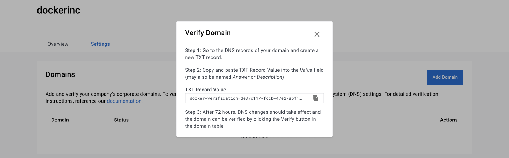
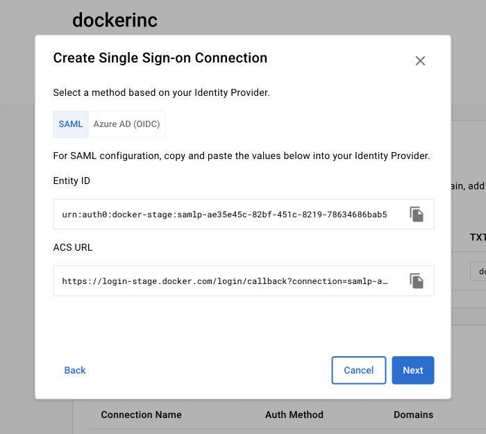
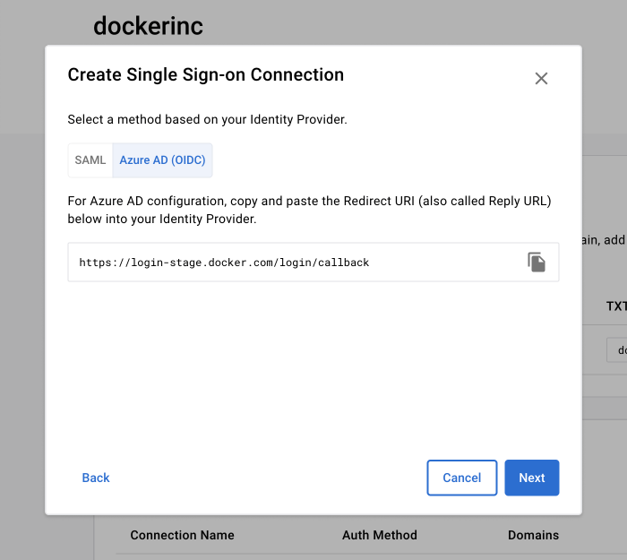

Follow the steps on this page to configure SSO for your organization or company. 

## Step one: Add and verify your domain

1. Sign in to Docker Hub, navigate to the **Organizations** page and select your organization or company.
2. Select **Settings**. If you are setting up SSO for an organization you then need to select **Security**. 
3. Select **Add Domain** and continue with the on-screen instructions to add the TXT Record Value to your domain name system (DNS).

    >**Note**
    >
    > Format your domains without protocol or www information, for example, yourcompany.com. This should include all email domains and subdomains users will use to access Docker. Public domains such as gmail.com, outlook.com, etc. aren’t permitted. Also, the email domain should be set as the primary email.

4. Once you have waited 72 hours for the TXT Record verification, you can then select **Verify** next to the domain you've added, and follow the on-screen instructions. 

{: width="700px" }

## Step two: Create an SSO connection

> **Important**
>
> If your IdP setup requires an Entity ID and the ACS URL, you must select the
> **SAML** tab in the **Authentication Method** section. For example, if your
> Azure AD Open ID Connect (OIDC) setup uses SAML configuration within Azure
> AD, you must select **SAML**. If you are [configuring Open ID Connect with Azure AD](https://docs.microsoft.com/en-us/powerapps/maker/portals/configure/configure-openid-settings){: target="_blank" rel="noopener" class="_"} select
> **Azure AD** as the authentication method. Also, IdP initiated connections
> aren't supported at this time.
{: .important}

1. Once your domain is verified, in the **Single Sign-on Connection** table select **Create Connections**, and create a name for the connection. 

    > **Note**
    >
    > You have to verify at least one domain before creating the connections.

2. Select an authentication method, **SAML** or **Azure AD (OIDC)**.
3. Copy the following fields and add them to your IdP:

   - SAML: **Entity ID**, **ACS URL**
   - Azure AD (OIDC): **Redirect URL**

   {: width="500px" }
   
   {: width="500px" }

4. From your IdP, copy and paste the following values into the Docker **Settings** fields:

    - SAML: **SAML Sign-on URL**, **x509 Certificate**
    - Azure AD (OIDC): **Client ID**, **Client Secret**, **Azure AD Domain**

5. Select the verified domains you want to apply the connection to.

6. To provision your users, select the organization(s) and/or team(s).

    > **Note**
    >
    > If you are a company owner and have more than one organization, you need to select a default organization.

7. Review your summary and select **Create Connection**.

## Step three: Test your SSO configuration

After you’ve completed the SSO configuration process in Docker Hub, you can test the configuration when you sign in to Docker Hub using an incognito browser. Sign in to Docker Hub using your domain email address. You are then redirected to your IdP's login page to authenticate.

1. Authenticate through email instead of using your Docker ID, and test the login process.
2. To authenticate through CLI, your users must have a PAT before you enforce SSO for CLI users.

>**Important**
>
> SSO has Just-In-Time (JIT) Provisioning enabled by default. This means your users are auto-provisioned into a team called 'Company' within your organization on Docker Hub. 
>
>You can change this on a per-app basis. To prevent auto-provisioning users, you can create a security group in your IdP and configure the SSO app to authenticate and authorize only those users that are in the security group. Follow the instructions provided by your IdP:
> - [Okta](https://help.okta.com/en-us/Content/Topics/Security/policies/configure-app-signon-policies.htm)
> - [AzureAD](https://learn.microsoft.com/en-us/azure/active-directory/develop/howto-restrict-your-app-to-a-set-of-users)
{: .important}

The SSO connection is now created. You can continue to set up [SCIM](../../docker-hub/scim.md) without enforcing SSO log-in.

## Optional step four: Enforce SSO 

1. In the **Single Sign-On Connections** table, select the **Action** icon and then **Enforce Single Sign-on**.
    When SSO is enforced, your users are unable to modify their email address and password, convert a user account to an organization, or set up 2FA through Docker Hub. You must enable 2FA through your IdP.
2. Continue with the on-screen instructions and verify that you’ve completed the tasks. 
3. Select **Turn on enforcement** to complete. 

Your users must now sign in to Docker with SSO. 

>**Important**
>
>If SSO isn't enforced, users can choose to sign in with either their Docker ID or SSO.
{: .important}

## What's next?

- [Manage you SSO connections](../manage/index.md)
- [Set up SCIM](../../docker-hub/scim.md)
- [Enable Group mapping](../../docker-hub/group-mapping.md)
