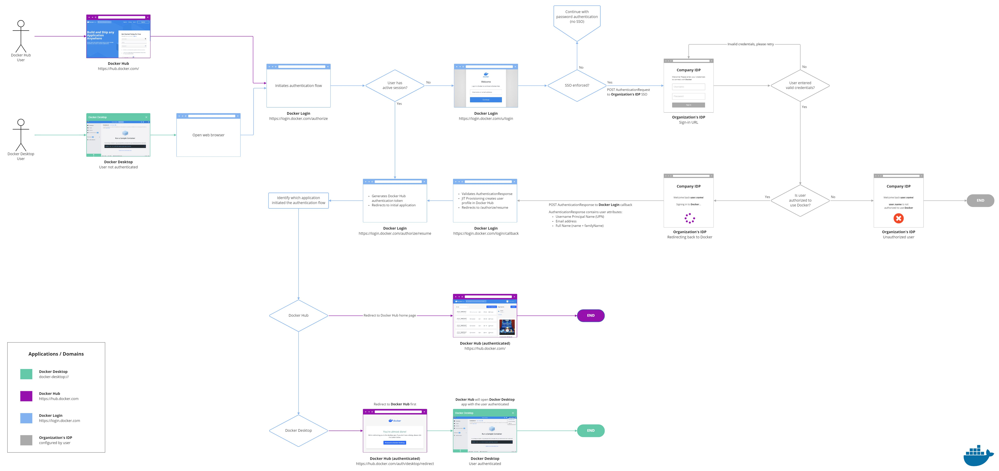

SSO allows users to authenticate using their identity providers (IdPs) to access Docker. SSO is available for a whole company, and all associated organizations, or an individual organization that has a Docker Business subscription. To upgrade your existing account to a Docker Business subscription, see [Upgrade your subscription](../subscription/upgrade/){:target="blank" rel="noopener" class=""}.

## How it works

When SSO is enabled, users are redirected to your IdP's authentication page to sign in. They cannot authenticate using their Docker login credentials (Docker ID and password). Docker currently supports Service Provider Initiated SSO flow. Your users must sign in to Docker Hub or Docker Desktop to initiate the SSO authentication process.

The following diagram shows how SSO operates and is managed in Docker Hub and Docker Desktop. In addition, it provides information on how to authenticate between your IdP.

{: target="_blank" rel="noopener" class="_"}

## How to set it up

Before enabling SSO in Docker Hub, administrators must first configure their IdP to work with Docker Hub. Docker provides the Assertion Consumer Service (ACS) URL and the Entity ID. Administrators use this information to establish a connection between their IdP server and Docker Hub.

After establishing the connection between the IdP server and Docker Hub, administrators sign in to the organization in Docker Hub and complete the SSO enablement process. 

When you enable SSO for your organization or company, a first-time user can sign in to Docker Hub using their company's domain email address. They're then added to your organization and assigned to your company's team.

Administrators can then choose to enforce SSO login and effortlessly manage SSO connections for their individual organization or company. 

## What's next?

- Check [the prerequisites](requirements/index.md)
- Explore [the FAQs](faqs.md)
- Start [configuring SSO](configure/index.md) for your organization or company