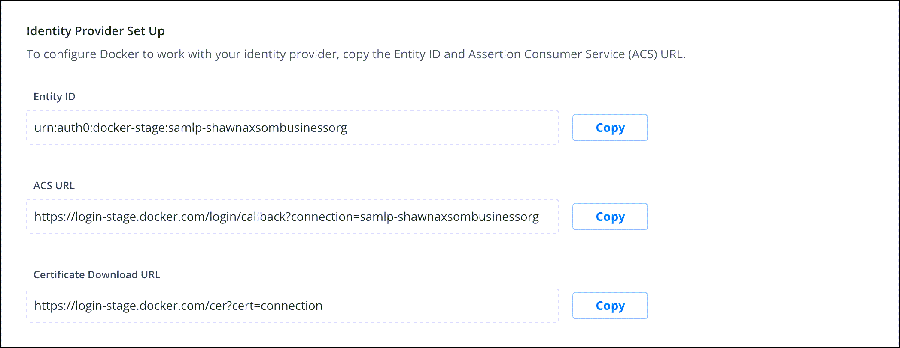
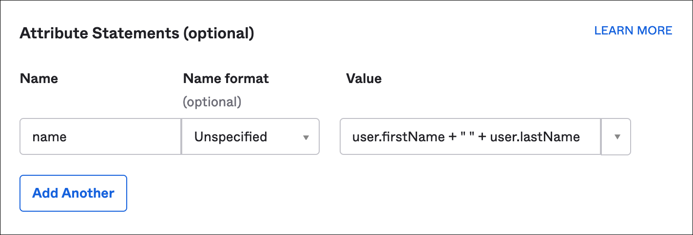
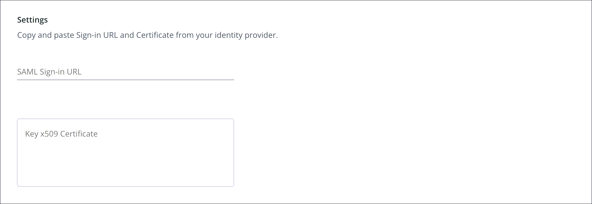
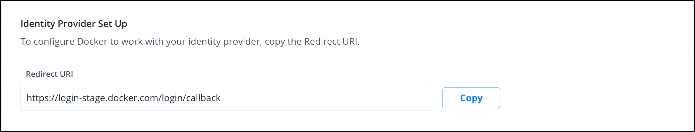
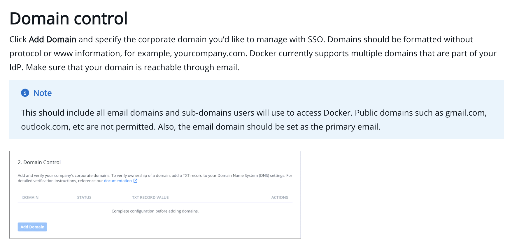
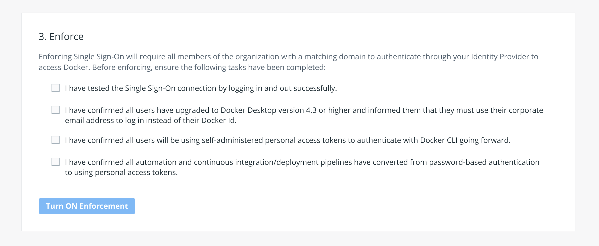

This section is for administrators who want to enable Docker Single Sign-on (SSO) for their businesses. Docker SSO allows users to authenticate using their identity providers (IdPs)  to access Docker. Docker currently supports SAML 2.0 and Azure AD authentication methods. You can enable SSO on organizations that are part of the Docker Business subscription. To upgrade your existing account to a Docker Business subscription, see [Upgrade your subscription](../subscription/upgrade/){:target="blank" rel="noopener" class=""}.

When SSO is enabled, users are redirected to your provider’s authentication page to log in. They cannot authenticate using their Docker login credentials  (Docker ID and password). Docker currently supports Service Provider Initiated SSO flow. Your users must sign in to Docker Hub or Docker Desktop to initiate the SSO authentication process.

Before enabling SSO in Docker Hub, administrators must configure their identity provider to configure their IdP to work with Docker Hub. Docker provides the Assertion Consumer Service (ACS) URL and the Entity ID. Administrators use this information to establish a connection between their IdP server and Docker Hub.

After establishing the connection between the IdP server and Docker Hub, administrators log in to the organization in Docker Hub and complete the SSO enablement process. See the section **Enable SSO in Docker Hub** for detailed instructions.

To enable SSO in Docker Hub, you need the following information from your identity provider:

* **SAML 2.0**: Single Sign-On URL and the X.509 signing certificate
* **Azure AD**: Client ID (a unique identifier for your registered AD application), Client Secret (a string used to gain access to your registered Azure AD application), and AD Domain details

We currently support enabling SSO on a single organization. However, we do not support single logout. If you have any users in your organization with a different domain (including social domains), they will be added to the organization as guests. Guests will continue to authenticate through Docker with their Docker login credentials (Docker ID and password).

## Prerequisites

* You must first notify your company about the new SSO login procedures
* Verify that your org members have Docker Desktop version 4.4.2 installed on their machines
* New org members must create a PAT to log in to the CLI, however existing users can currently use their username and password during the grace period as specified below
* Confirm that all CI/CD pipelines have replaced their passwords with PATs
* For your service accounts, add your additional domains or enable it in your IdP
* Test SSO using your domain email address and IdP password to successfully log in and log out of Docker Hub

## Create a Personal Access Token (PAT)

Before you configure SSO for your organization, new members of your organization must [create an access token](../docker-hub/access-tokens.md) to log in to the CLI. There is currently a grace period for existing users, which will expire in the near future. Before the grace period ends, your users will be able to log in from Docker Desktop CLI using their previous credentials until PATs are mandatory.
In addition, all email addresses should be added to your IdP.

## Configure

To configure SSO, log in to [Docker Hub](https://hub.docker.com){: target="_blank" rel="noopener" class="_"} to obtain the **ACS URL** and **Entity IDs** to complete the IdP server configuration process. You can only configure SSO with a single IdP.  When this is complete, log back in to [Docker Hub](https://hub.docker.com){: target="_blank" rel="noopener" class="_"} and complete the SSO enablement process.

> **Important**
>
> If your IdP setup requires an Entity ID and the ACS URL, you must select the
> **SAML** tab in the **Authentication Method** section. For example, if your
> Azure AD setup uses SAML configuration within Azure AD, you must select
> **SAML**. If you are [configuring Open ID Connect with Azure AD](https://docs.microsoft.com/en-us/powerapps/maker/portals/configure/configure-openid-settings){: target="_blank" rel="noopener" class="_"} select **Azure AD** as the
> authentication method. Also, IdP initiated connections are not supported at
> this time.
{: .important}

The following video walks you through the process of configuring SSO.

<iframe width="560" height="315" src="https://www.youtube-nocookie.com/embed/QY0j02ggf64" frameborder="0" allow="accelerometer; autoplay; clipboard-write; encrypted-media; gyroscope; picture-in-picture" allowfullscreen></iframe>

### SAML 2.0 IdP configuration

1. Log in to [Docker Hub](https://hub.docker.com){: target="_blank" rel="noopener" class="_"} as an administrator and navigate to **Organizations** and select the organization that you want to enable SSO on.
2. Click **Settings** and select the **Security** tab.
3. Select an authentication method for **SAML 2.0**.

    {:width="500px"}

4. In the Identity Provider Set Up, copy the **Entity ID**, **ACS URL** and **Certificate Download URL**.

    {:width="500px"}

5. Log in to your IdP to complete the IdP server configuration process. Refer to your IdP documentation for detailed instructions.

    > **Note:**
    >
    > the NameID is your email address and is set as the default.
    > For example, <Subject><NameID>yourname@mycompany.com</NameID>. We also support the optional `name` attribute. This attribute name must be lower-cased. _The following is an example of this attribute in Okta._

    {:width="500px"}

6. Complete the fields in the **Configuration Settings** section and click **Save**. If you want to change your IdP, you must delete your existing provider and configure SSO with your new IdP.

    {:width="500px"}

7. Proceed to **add your domain** before you test and enforce SSO.

### Azure AD IdP configuration with Open ID Connect

>**Note:**
>
> This section is for users who only want to configure Open ID Connect with
> Azure AD. This connection is a basic OIDC connection, and there are no
> special customizations available when using it.

1. Log in to [Docker Hub](https://hub.docker.com){: target="_blank" rel="noopener" class="_"} as an administrator and navigate to **Organizations** and select the organization that you want to enable SSO on.
2. Click **Settings** and select the **Security** tab.
3. Select an authentication method for **Azure AD**.

    {:width="500px"}

4. In the Identity Provider Set Up, copy the **Redirect URL / Reply URL**.

    {:width="500px"}

5. Log in to your IdP to complete the IdP server configuration process. Refer to your IdP documentation for detailed instructions.

    > **Note:**
    > the NameID is your email address and is set as the default.
    > For example: <Subject><NameID>yourname@mycompany.com</NameID>.

6. Complete the fields in the **Configuration Settings** section and click **Save**. If you want to change your IdP, you must delete your existing provider and configure SSO with your new IdP.

    {:width="500px"}

7. Proceed to **add your domain** before you test and enforce SSO.

### Domain control

Click **Add Domain** and specify the corporate domain you’d like to manage with SSO. Domains should be formatted without protocol or www information, for example, yourcompany.com. Docker currently supports multiple domains that are part of your IdP. Make sure that your domain is reachable through email.

> **Note**
>
> This should include all email domains and sub-domains users will use to access Docker.
> Public domains such as gmail.com, outlook.com, etc are not permitted.
> Also, the email domain should be set as the primary email.

{:width="500px"}

### Domain verification

To verify ownership of a domain, add a TXT record to your Domain Name System (DNS) settings.

1. Copy the provided TXT record value and navigate to your DNS host and locate the **Settings** page to add a new record.
2. Select the option to add a new record and paste the TXT record value into the applicable field. For example, the **Value**, **Answer** or **Description** field.

    Your DNS record may have the following fields:
    * Record type: enter your 'TXT' record value
    * Name/Host/Alias: leave the default (@ or blank)
    * Time to live (TTL): enter **86400**

3. After you have updated the fields, click **Save**.

    > **Note:**
    >
    > It can take up to 72 hours for DNS changes to take effect, depending on
    > your DNS host. The Domains table will have an Unverified status during
    > this time.

4. In the Security section of your Docker organization, click **Verify** next to the domain you want to verify after 72 hours.

## Test your SSO configuration

After you’ve completed the SSO configuration process in Docker Hub, you can test the configuration when you log in to Docker Hub using an incognito browser. Login using your domain email address and IdP password.  You will then get redirected to your identity provider’s login page to authenticate.

1. Authenticate through email instead of using your Docker ID, and test the login process.
2. To authenticate through CLI, your users must have a PAT before you enforce SSO for CLI users.

## Enforce SSO in Docker Hub

Before you enforce SSO in Docker Hub, you must complete the following:
Test SSO by logging in and out successfully, confirm that all members in your org have upgraded to Docker Desktop version 4.4.2, PATs are created for each member, CI/CD passwords are converted to PAT. Also, when using Docker partner products (for example, VS Code), you must use a PAT when you enforce SSO. For your service accounts add your additional domains in **Add Domains** or enable the accounts in your IdP.

Admins can force users to authenticate with Docker Desktop by provisioning a registry.json configuration file. The registry.json file will force users to authenticate as a user that is configured in the allowedOrgs list in the registry.json file. For info on how to configure a registry.json file see [Configure registry.json](../docker-hub/image-access-management.md#enforce-authentication)

1. On the Single Sign-On page in Docker Hub, click **Turn ON Enforcement** to enable your SSO.
2. When SSO is enforced, your members are unable to modify their email address and password, convert a user account to an organization, or set up 2FA through Docker Hub. You must enable 2FA through your IdP.

> **Note:**
>
> If you want to turn off SSO and revert back to Docker’s built-in
> authentication, click **Turn OFF Enforcement**. Your members aren’t
> forced to authenticate through your IdP and can log in to Docker using
> their personal credentials.

{:width="500px"}

## Manage users when SSO is enabled

You don’t need to add users to your organization in Docker Hub manually. You just need to make sure an account for your users exists in your IdP. When users sign in to Docker Hub, they're automatically assigned to the organization using their domain email address.

 > **Note:**
 >
 > when the first-time user logs in to Docker using their domain email
 > address, they are then added to your organization.

To add a guest to your organization in Docker Hub if they aren’t verified through your IdP:

1. Go to **Organizations** in Docker Hub, and select your organization.
2. Click **Add Member**, enter the email address, and select a team from the drop-down list.
3. Click **Add** to confirm.

## Remove members from the SSO organization

To remove a member from an organization:

1. Log in to [Docker Hub](https://hub.docker.com){: target="_blank" rel="noopener" class="_"} as an administrator of your organization.
2. Select the organization from the list. The organization page displays a list of members.
2. Click the **x** next to a member’s name to remove them from all the teams in the organization.
3. Click **Remove** to confirm. The member will receive an email notification confirming the removal.

> **Note:**
>
> when you remove a member from an SSO organization, they are unable to log
> in using their email address.

## FAQs
To learn more see our [FAQs](faqs.md).

## Deleting SSO

When you disable SSO, you can delete the connection to remove the configuration settings and the added domains. Once you delete this connection, it cannot be undone. Users must authenticate with their Docker ID and password or create a password reset if they do not have one.

{:width="500px"}
