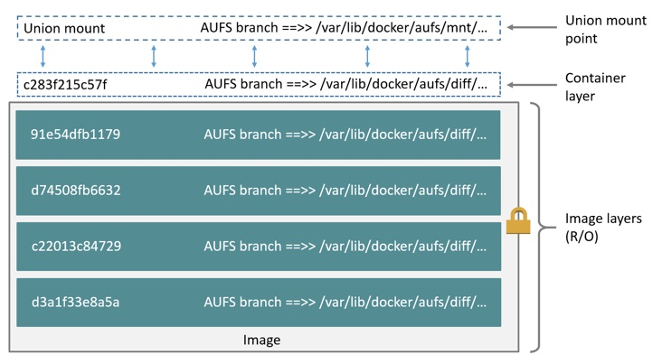

AUFS is a *union filesystem*. The `aufs` storage driver was previously the default
storage driver used for managing images and layers on Docker for Ubuntu, and for
Debian versions prior to Stretch. If your Linux kernel is version 4.0 or higher,
and you use Docker Engine - Community, consider using the newer
[overlay2](overlayfs-driver.md){: target="_blank" class="_" }, which has
potential performance advantages over the `aufs` storage driver.

> **Note**
>
> AUFS is not supported on some distributions and Docker editions. See
> [Prerequisites](#prerequisites) for more information about supported
> platforms.

## Prerequisites

- For Docker Engine - Community, AUFS is supported on Ubuntu, and on Debian versions prior to
  Stretch.
- For Docker EE, AUFS is supported on Ubuntu.
- If you use Ubuntu, you need to add the AUFS module to the kernel. If you do
  not install these packages, you need to use  `overlay2`.
- AUFS cannot use the following backing filesystems: `aufs`, `btrfs`, or
  `ecryptfs`. This means that the filesystem which contains
  `/var/lib/docker/aufs` cannot be one of these filesystem types.

## Configure Docker with the `aufs` storage driver

If the AUFS driver is loaded into the kernel when you start Docker, and no other
storage driver is configured, Docker uses it by default.

1.  Use the following command to verify that your kernel supports AUFS.

    ```bash
    $ grep aufs /proc/filesystems

    nodev   aufs
    ```

2.  Check which storage driver Docker is using.

    ```bash
    $ docker info

    <truncated output>
    Storage Driver: aufs
     Root Dir: /var/lib/docker/aufs
     Backing Filesystem: extfs
     Dirs: 0
     Dirperm1 Supported: true
    <truncated output>
    ```

3.  If you are using a different storage driver, either AUFS is not included in
    the kernel (in which case a different default driver is used) or that
    Docker has been explicitly configured to use a different driver. Check
    `/etc/docker/daemon.json` or the output of `ps auxw | grep dockerd` to see
    if Docker has been started with the `--storage-driver` flag.

## How the `aufs` storage driver works

AUFS is a *union filesystem*, which means that it layers multiple directories on
a single Linux host and presents them as a single directory. These directories
are called _branches_ in AUFS terminology, and _layers_ in Docker terminology.

The unification process is referred to as a _union mount_.

The diagram below shows a Docker container based on the `ubuntu:latest` image.



Each image layer, and the container layer, are represented on the Docker host as
subdirectories within `/var/lib/docker/`. The union mount provides the unified
view of all layers. The directory names do not directly correspond to the IDs
of the layers themselves.

AUFS uses the Copy-on-Write (CoW) strategy to maximize storage efficiency and
minimize overhead.

### Example: Image and container on-disk constructs

The following `docker pull` command shows a Docker host downloading a Docker
image comprising five layers.

```bash
$ docker pull ubuntu

Using default tag: latest
latest: Pulling from library/ubuntu
b6f892c0043b: Pull complete
55010f332b04: Pull complete
2955fb827c94: Pull complete
3deef3fcbd30: Pull complete
cf9722e506aa: Pull complete
Digest: sha256:382452f82a8bbd34443b2c727650af46aced0f94a44463c62a9848133ecb1aa8
Status: Downloaded newer image for ubuntu:latest
```

#### The image layers

> **Warning**: Do not directly manipulate any files or directories within
> `/var/lib/docker/`. These files and directories are managed by Docker.

All of the information about the image and container layers is stored in
subdirectories of `/var/lib/docker/aufs/`.

- `diff/`: the **contents** of each layer, each stored in a separate
  subdirectory
- `layers/`: metadata about how image layers are stacked. This directory
  contains one file for each image or container layer on the Docker host. Each
  file contains the IDs of all the layers below it in the stack (its parents).
- `mnt/`: Mount points, one per image or container layer, which are used to
  assemble and mount the unified filesystem for a container. For images, which
  are read-only, these directories are always empty.

#### The container layer

If a container is running, the contents of `/var/lib/docker/aufs/` change in the
following ways:

- `diff/`: Differences introduced in the writable container layer, such as new
   or modified files.
- `layers/`: Metadata about the writable container layer's parent layers.
- `mnt/`: A mount point for each running container's unified filesystem, exactly
  as it appears from within the container.

## How container reads and writes work with `aufs`

### Reading files

Consider three scenarios where a container opens a file for read access with
aufs.

- **The file does not exist in the container layer**: If a container opens a
  file for read access and the file does not already exist in the container
  layer, the storage driver searches for the file in the image layers,
  starting with the layer just below the container layer. It is read from the
  layer where it is found.

- **The file only exists in the container layer**: If a container opens a file
  for read access and the file exists in the container layer, it is read from
  there.

- **The file exists in both the container layer and the image layer**: If a
  container opens a file for read access and the file exists in the container
  layer and one or more image layers, the file is read from the container layer.
  Files in the container layer obscure files with the same name in the image
  layers.

### Modifying files or directories

Consider some scenarios where files in a container are modified.

- **Writing to a file for the first time**: The first time a container writes
  to an existing file, that file does not exist in the container (`upperdir`).
  The `aufs` driver performs a *copy_up* operation to copy the file from the
  image layer where it exists to the writable container layer. The container
  then writes the changes to the new copy of the file in the container layer.

  However, AUFS works at the file level rather than the block level. This
  means that all copy_up operations copy the entire file, even if the file is
  very large and only a small part of it is being modified. This can have a
  noticeable impact on container write performance. AUFS can suffer
  noticeable latencies when searching for files in images with many layers.
  However, it is worth noting that the copy_up operation only occurs the first
  time a given file is written to. Subsequent writes to the same file operate
  against the copy of the file already copied up to the container.

- **Deleting files and directories**:

  - When a _file_ is deleted within a container, a *whiteout* file is created
    in the container layer. The version of the file in the image layer is not
    deleted (because the image layers are read-only). However, the whiteout
    file prevents it from being available to the container.

  - When a _directory_ is deleted within a container, an _opaque file_ is
    created in the container layer. This works in the same way as a
    whiteout file and effectively prevents the directory from being accessed,
    even though it still exists in the image layer.

- **Renaming directories**: Calling `rename(2)` for a directory is not fully
  supported on AUFS. It returns `EXDEV` ("cross-device link not permitted"),
  even when both of the source and the destination path are on a same AUFS
  layer, unless the directory has no children. Your application needs to be
  designed to handle `EXDEV` and fall back to a "copy and unlink" strategy.

## AUFS and Docker performance

To summarize some of the performance related aspects already mentioned:

- The AUFS storage driver is less performant than the `overlay2` driver, but is
  a good choice for PaaS and other similar use-cases where container density is
  important. This is because AUFS efficiently shares images between multiple
  running containers, enabling fast container start times and minimal use of
  disk space.

- The underlying mechanics of how AUFS shares files between image layers and
  containers uses the page cache very efficiently.

- The AUFS storage driver can introduce significant latencies into container
  write performance. This is because the first time a container writes to any
  file, the file needs to be located and copied into the containers top writable
  layer. These latencies increase and are compounded when these files exist below
  many image layers and the files themselves are large.

### Performance best practices

The following generic performance best practices also apply to AUFS.

- **Solid State Devices (SSD)** provide faster reads and writes than spinning
  disks.

- **Use volumes for write-heavy workloads**: Volumes provide the best and most
  predictable performance for write-heavy workloads. This is because they bypass
  the storage driver and do not incur any of the potential overheads introduced
  by thin provisioning and copy-on-write. Volumes have other benefits, such as
  allowing you to share data among containers and persisting even when no
  running container is using them.

## Related information

- [Volumes](../volumes.md)
- [Understand images, containers, and storage drivers](index.md)
- [Select a storage driver](select-storage-driver.md)
