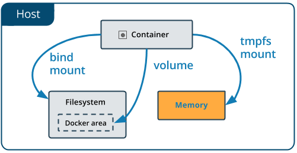

[Volumes](volumes.md) and [bind mounts](bind-mounts.md) let you share files
between the host machine and container so that you can persist data even after
the container is stopped.

If you're running Docker on Linux, you have a third option: `tmpfs` mounts.
When you create a container with a `tmpfs` mount, the container can create
files outside the container's writable layer.

As opposed to volumes and bind mounts, a `tmpfs` mount is temporary, and only
persisted in the host memory. When the container stops, the `tmpfs` mount is
removed, and files written there won't be persisted.



This is useful to temporarily store sensitive files that you don't want to
persist in either the host or the container writable layer.

## Limitations of tmpfs mounts

* Unlike volumes and bind mounts, you can't share `tmpfs` mounts between
containers.
* This functionality is only available if you're running Docker on Linux.

## Choose the --tmpfs or --mount flag

In general, `--mount` is more explicit and verbose. The biggest difference is
that the `--tmpfs` flag does not support any configurable options.

- **`--tmpfs`**: Mounts a `tmpfs` mount without allowing you to specify any
  configurable options, and can only be used with standalone containers.

- **`--mount`**: Consists of multiple key-value pairs, separated by commas and each
  consisting of a `<key>=<value>` tuple. The `--mount` syntax is more verbose
  than `--tmpfs`:
  - The `type` of the mount, which can be [`bind`](bind-mounts.md), `volume`, or
    [`tmpfs`](tmpfs.md). This topic discusses `tmpfs`, so the type is always
    `tmpfs`.
  - The `destination` takes as its value the path where the `tmpfs` mount
    is mounted in the container. May be specified as `destination`, `dst`,
    or `target`.
  - The `tmpfs-size` and `tmpfs-mode` options. See
    [tmpfs options](#specify-tmpfs-options).

The examples below show both the `--mount` and `--tmpfs` syntax where possible,
and `--mount` is presented first.

### Differences between `--tmpfs` and `--mount` behavior

- The `--tmpfs` flag does not allow you to specify any configurable options.
- The `--tmpfs` flag cannot be used with swarm services. You must use `--mount`.

## Use a tmpfs mount in a container

To use a `tmpfs` mount in a container, use the `--tmpfs` flag, or use the
`--mount` flag with `type=tmpfs` and `destination` options. There is no
`source` for `tmpfs` mounts. The following example creates a `tmpfs` mount at
`/app` in a Nginx container. The first example uses the `--mount` flag and the
second uses the `--tmpfs` flag.

<ul class="nav nav-tabs">
  <li class="active"><a data-toggle="tab" data-group="mount" data-target="#mount-run"><code>--mount</code></a></li>
  <li><a data-toggle="tab" data-group="volume" data-target="#tmpfs-run"><code>--tmpfs</code></a></li>
</ul>
<div class="tab-content">
<div id="mount-run" class="tab-pane fade in active" markdown="1">

```console
$ docker run -d \
  -it \
  --name tmptest \
  --mount type=tmpfs,destination=/app \
  nginx:latest
```

</div><!--mount-->
<div id="tmpfs-run" class="tab-pane fade" markdown="1">

```console
$ docker run -d \
  -it \
  --name tmptest \
  --tmpfs /app \
  nginx:latest
```

</div><!--volume-->
</div><!--tab-content-->

Verify that the mount is a `tmpfs` mount by looking in the `Mounts` section of
the `docker inspect` output:

```console
$ docker inspect tmptest --format '{{ json .Mounts }}'
[{"Type":"tmpfs","Source":"","Destination":"/app","Mode":"","RW":true,"Propagation":""}]
```

Stop and remove the container:

```console
$ docker stop tmptest
$ docker rm tmptest
```

### Specify tmpfs options

`tmpfs` mounts allow for two configuration options, neither of which is
required. If you need to specify these options, you must use the `--mount` flag,
as the `--tmpfs` flag does not support them.

| Option       | Description                                                                                           |
|:-------------|:------------------------------------------------------------------------------------------------------|
| `tmpfs-size` | Size of the tmpfs mount in bytes. Unlimited by default.                                               |
| `tmpfs-mode` | File mode of the tmpfs in octal. For instance, `700` or `0770`. Defaults to `1777` or world-writable. |

The following example sets the `tmpfs-mode` to `1770`, so that it is not
world-readable within the container.

```console
docker run -d \
  -it \
  --name tmptest \
  --mount type=tmpfs,destination=/app,tmpfs-mode=1770 \
  nginx:latest
```

## Next steps

- Learn about [volumes](volumes.md)
- Learn about [bind mounts](bind-mounts.md)
- Learn about [storage drivers](/storage/storagedriver/)
