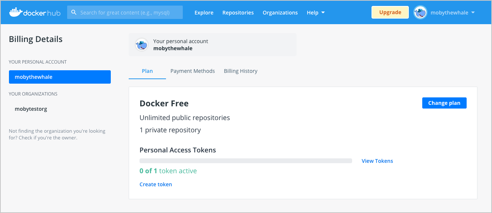

This page contains information on how to purchase a Docker paid subscription. It also contains information on how to upgrade your existing subscription and update your billing information.

You can upgrade to a Docker Pro, Team, or a Business subscription from a Personal subscription. When you upgrade to a paid subscription, you can immediately use all the features and entitlements offered in your new subscription. For detailed information on features available in each subscription, see [Docker Pricing](https://www.docker.com/pricing){: target="_blank" rel="noopener" class="_"}.

## Purchase a subscription

The following section contains information on how to purchase a Docker  subscription for new customers.

To purchase Docker subscription:

1. Log into your [Docker Hub](https://hub.docker.com){: target="_blank" rel="noopener" class="_"} account.

2. Open the drop-down menu next to your username in the top-right corner and select **Billing** to go to the **Billing Details** page. This page displays billing information about your existing user account.

   > **Note**

   > Ensure you have selected your personal account on the left side of the
   > **Billing Details** page. For example, if you want to purchase a Docker
   >  Pro account, you must select your personal account.

3. Click **Change plan** and navigate to the pricing page to purchase a subscription and follow the on-screen instructions to purchase.

    > **Note**

    > You can select from the following options: Pro, Team, or Business
    > subscription. The annual subscription is set by default. Select **Pay
    >  Monthly**  to change to a monthly subscription.

4. If you are purchasing a Team plan, provide the organization details and click **Continue to Org Size**. Review your Team plan and click **Continue to Payment**.
    You can also specify the number of users you’d like to add to your organization. On the **Organization size** page, annual subscription by default. If you prefer to change this, select **Pay Monthly**.

5. You will receive an email confirming your subscription.

8. Open the drop-down menu next to your username in the top-right corner and select **Billing**.

    >**Note**

    > You can view the information about your new subscription on the
    > **Billing** page.

## Purchase Docker Business

The Docker Business subscription is currently available to purchase through the Docker Sales team. To purchase a Docker Business subscription, [Contact Sales](https://www.docker.com/pricing/contact-sales){: target="_blank" rel="noopener" class="_" id="dkr_docs_subscription_btl"}.

## Upgrade your subscription

To upgrade to a Pro or Team:

1. Log into your [Docker Hub](https://hub.docker.com){: target="_blank" rel="noopener" class="_"} account.

2. Open the drop-down menu next to your username in the top-right corner and select **Billing**. The **Billing Details** page displays billing information about your existing user account.

    >**Note**

    > Ensure you have selected your personal account or organization on the
    > left side of the **Billing Details** page.

    {:width="750px"}

3. Click **Change plan** and navigate the pricing page to upgrade your subscription and continue with the on-screen instructions.

    You can select from the following options: Pro, Team, or Business subscription. The annual subscription is set by default. Select Pay Monthly to change to a monthly subscription.

4. When upgrading to a Team plan, provide the organization details and click **Continue to Org Size**. Review your Team plan and click **Continue to Payment**.

 You can also specify the number of users you’d like to add to your organization. On the **Organization size** page, the cost for the annual subscription is set by default. If you prefer to change this, select **Pay Monthly**.

5. You’ll also receive an email confirming the cancellation of your legacy subscription..

6. Open the drop-down menu next to your username in the top-right corner and select **Billing**.

  >**Note**

  > You can view the information about your new subscription and the total cost
  > on the **Billing** page.

## Upgrade to Docker Business

To upgrade to a Docker Business subscription, [Contact Sales](https://www.docker.com/pricing/contact-sales){: target="_blank" rel="noopener" class="_" id="dkr_docs_subscription_btl"}.

## Upgrade from a monthly subscription to an annual subscription

To upgrade from a monthly subscription to an annual subscription:

1. Log into your [Docker Hub](https://hub.docker.com){: target="_blank" rel="noopener" class="_"} account as an organization owner or with your personal account.
2. Open the drop-down menu next to your username in the top-right corner and select **Billing**.
3. Select your personal account or organization from the left-hand menu and select the **Payment Methods** tab
4. Click **switch to annual billing**.
5. Review the information displayed on the **Change to an Annual subscription** page and click **Accept Terms and Purchase** to confirm.

You can view the confirmation of the upgrade with an invoice containing details about your new subscription, entitlements, and the total cost on the **Billing** page.

## Update billing information

You must be on owner of the organization to make changes to the billing information.

To update the billing information for your organization or personal account:

1. Log into your [Docker Hub](https://hub.docker.com){: target="_blank" rel="noopener" class="_"} account as an organization owner or with your personal account.

2. Open the drop-down menu next to your username in the top-right corner and select **Billing**.

3. Select your personal account or organization from the left-hand menu and select the Billing tab.

4. Select the **Payment Methods**  tab and continue with the on-screen instructions.

    > **Note**
    >
    > The details displayed in the **Contact Information** section is used to generate your invoice. All billing-related information is sent to the email address listed in this section.

6. Click **Update** to save your changes.
