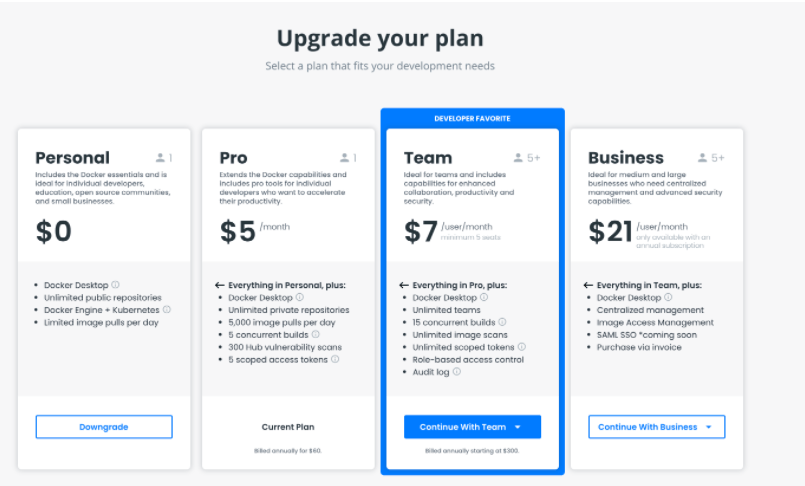

This page contains information on how to purchase a Docker paid subscription. It also contains information on how to upgrade your existing subscription and update your billing information.

You can upgrade from Docker Personal to a Pro, Team, or a Business subscription from a Personal subscription. When you upgrade to a paid subscription, you can immediately use all the features and entitlements offered in your new subscription. For detailed information on features available in each subscription, see [Docker Pricing](https://www.docker.com/pricing){: target="_blank" rel="noopener" class="_"}.

## Upgrade from a Personal to a Pro, Team, or Business Subscription

The following section contains information on how to purchase a Docker  subscription for new customers. To upgrade from a Personal subscription to a Team or Business subscription, you must first convert your personal namespace to an organization namespace. To learn more, see [convert an account into an organization](../docker-hub/convert-account.md).

To purchase a Pro, Team, or Business subscription:

1. Log into your [Docker Hub](https://hub.docker.com){: target="_blank" rel="noopener" class="_"} account.

2. Click **Upgrade** and select your Pro, Team, or Business subscription.

   > **Note**
   >
   >If you have not created an organization for a Team or Business subscription, select **Create Organization** from the drop-down menu and select your plan. Click **Buy Now** and continue with the on-screen instructions.

3. On the **Organization Size** page, select your annual or monthly subscription and update the number of users for your organization. For a Business subscription, the only option available is annually.

    > **Note**
    >
    >To upgrade to a Business subscription, you must have at least 5 users and at least 40 users through purchase orders. To create a purchase order,  specify the number of users and then click the **Contact Sales form**. Then, continue the on-screen instructions for the billing details and click **Purchase**.

4. Click **Continue to Purchase** and update the fields to complete your purchase.

## Upgrade to a Team or Business subscription

The following section is for upgrading your current subscription to a Team or Business subscription. You can now use the self-service option to purchase Docker Business seats through a credit card. To upgrade to a Team or Business subscription you must first convert your personal namespace to an organization namespace. To learn more, see [convert an account into an organization](../docker-hub/convert-account.md).

To upgrade your subscription:

1. Log into your [Docker Hub](https://hub.docker.com){: target="_blank" rel="noopener" class="_"} account.

2. Open the drop-down menu next to your username in the top-right corner and select **Billing**. The **Billing Details** page displays billing information about your existing user account.

    >**Note**
    >
    > Ensure you have selected the correct account on the
    left side of the **Billing Details** page. For example, if you want to upgrade to a Docker Pro subscription, you must select your personal account.

3. Click **Change plan** and navigate the pricing page to upgrade your subscription.

4. Select your subscription and continue with the on-screen instructions.

     >**Note**
     >
     > Click **Create Organization** if you want to add another organization to your subscription. Click Buy Now to proceed with the on-screen instructions.

     

5. On the **Organization Size** page, select your annual or monthly subscription and update the number of users for your organization. For a Business subscription, the only option available is annually.

    > **Note**
    >
    > To upgrade to a Business subscription, 5 is the maximum number of users you can add using a credit card and 40 users for purchase orders. If you want to create a purchase order, update the field for the users and click **Contact Sales** to complete the contact sales form.  Then, continue the on-screen instructions for the billing details and click **Purchase**.

6. Click **Continue to Payment** and continue to on-screen instructions and click Purchase to complete your subscription.

## Switch from a monthly subscription to an annual subscription

To upgrade from a monthly subscription to an annual subscription:

1. Log into your [Docker Hub](https://hub.docker.com){: target="_blank" rel="noopener" class="_"} account as an organization owner or with your personal account.
2. Open the drop-down menu next to your username in the top-right corner and select **Billing**.
3. Select your personal account or organization from the left-hand menu and select the **Payment Methods** tab.
4. Click **switch to annual billing**
5. Review the information displayed on the **Change to an Annual subscription** page and click **Accept Terms and Purchase** to confirm.

You can view the confirmation of the upgrade with an invoice containing details about your new subscription, entitlements, and the total cost on the **Billing** page.

## Update billing information

You must be an owner of the organization to make changes to the billing information.

To update the billing information for your organization or personal account:

1. Log into your [Docker Hub](https://hub.docker.com){: target="_blank" rel="noopener" class="_"} account as an organization owner or with your personal account.

2. Open the drop-down menu next to your username in the top-right corner and select **Billing**.

3. Select your personal account or organization from the left-hand menu, select the **Payment Methods** tab, and continue with the on-screen instructions.

    > **Note**
    >
    > The details displayed in the **Contact Information** section is used to generate your invoice. All billing-related information is sent to the email address listed in this section.

4. Click **Update** to save your changes.
