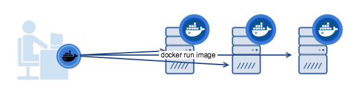

Welcome to the Docker documentation test page!

This is a demo of components, tags, styles, tools, and strategies we use for the
docs. We explain the code behind the published page and demo the effects. So, if
you want to see, for example, how admonitions and notes are coded in markdown,
read the section on [Admonitions (notes)](test.md#admonitions-notes) on the web
published page and study the pre-processed `test.md` to see how they are
implemented. The Docker documentation team uses this page as "note to self"
reminders. Since we invite docs suggestions and contributions from the
community, we've always made the test page generally available.

If you want to understand how something in the docs is coded, use this page is
as a resource.

If, in the course of making docs updates and suggestions, you develop a new
strategy or component for the docs, feel free to add a demo and explanation to
this test page and submit a PR for it so we can review and discuss it.

Cool? Let's dive in!

# Heading 1

Most pages don't actually have a H1 heading. The page title from the metadata is
automatically inserted. We have included it here to show all heading levels, and
set front matter as `toc_min: 1` so that it shows in the navigation bar (on-page
topics).

## Heading 2

By default, this is the highest heading included in the right navigation bar. To
include more heading levels, set `toc_min: 1` in the page's front-matter (as is
done on this `test.md` page). You can go all the way to 6, but if `toc_min` is
geater than `toc_max` then no headings are shown.

### Heading 3

This is the lowest heading included in the right-nav, by default. To include
more heading levels, set `toc_max: 4` in the page's front-matter. You can go all
the way to 6.

#### Heading 4

This heading is not included in the right-nav. To include it set `toc_max: 4` in
the page's front-matter.

##### Heading 5

This heading is not included in the right-nav. To include it set `toc_max: 5` in
the page's front-matter.

###### Heading 6

This is probably too many headings. Try to avoid it.

This heading is not included in the right-nav. To include it set `toc_max: 6` in
the page's front-matter.

## Typography

Plain block of text.

Lorem ipsum dolor sit amet, consectetur adipisicing elit, sed do eiusmod tempor
incididunt ut labore et dolore magna aliqua. Ut enim ad minim veniam, quis
nostrud exercitation ullamco laboris nisi ut aliquip ex ea commodo consequat.
Duis aute irure dolor in reprehenderit in voluptate velit esse cillum dolore eu
fugiat nulla pariatur. Excepteur sint occaecat cupidatat non proident, sunt in
culpa qui officia deserunt mollit anim id est laborum.

**Inline text styles**:

- **bold**
- _italic_
- ***bold italic***
- ~~strikethrough~~
- <u>underline</u>
- _<u>underline italic</u>_
- **<u>underline bold</u>**
- ***<u>underline bold italic</u>***
- `monospace text`
- **`monospace bold`**

## Links and images

### Links

- [a markdown link](https://docker.com/)
https://github.com/docker/docker.github.io/tree/master/docker-cloud/images
- [a markdown link that opens in a new window](https://docker.com/){: target="_blank" class="_" }
  (the `class="_"` trick prevents Atom from italicizing the whole rest of the file until it encounters another underscore.)

- [a markdown link to a custom target ID](#custom-target-id)

- <a href="https://docker.com/">an HTML link</a>

- <a href="https://docker.com/" target="_blank" class="_">an HTML link that opens in a new window</a>

- A link to a Github PR in `docker/docker`: 

- A link to a Github PR in `docker/docker.github.io`: 

  - You can specify `org=foo` to use a Github organization other than Docker

- A link to an auto-generated reference page that we pull in during docs builds:
[/engine/reference/builder/#env](/engine/reference/builder/#env).

  - If you can't find a reference page in the `docker.github.io`
  GitHub repository, but see it out on `docs.docker.com`, you can
  surmise that it's probably auto-generated from the codebase.
  (FYI, to view the markdown source for the file, just click
  **Edit this page** on `docs.docker.com`. But don't use that URL in your docs.)

  - Go to the file in a web browser, grab everything after the domain name
  from the URL, and use that as the link in your docs file.

  - Keep in mind that this link doesn't resolve until you merge the PR and
  your docs are published on [docs.docker.com](/).

{: id="custom-target-id"}

#### Using a custom target ID
This topic has a custom target ID above its heading that can be used to link to
it, in addition to, or instead of, the default concatenated heading style. The
format of this ID is `{: id="custom-target-id"}`.

You can use custom targets to link to headings or even paragraphs. You link to
it as you would any other link, using `#custom-target-id` as the ultimate
target.

An example of a custom target ID in the documentation is the topic on
[Compose file version 2 topic on CPU and other resources](compose/compose-file/compose-file-v2.md#cpu-and-other-resources).
It has a long heading that breaks the normal markdown linking mechanism,
so we added a custom ID above the target heading.

### Images

- A small cute image: 

- A small cute image that is a link. The extra newline here makes it not show
  inline:

  [](https://www.docker.com/)

- A big wide image: 

- The same as above but using HTML: 

[Some Bootstrap image classes](https://v4-alpha.getbootstrap.com/content/images/)
might be interesting. You can use them with Markdown or HTML images.

- An image using the Bootstrap "thumbnail" class: {: class="img-thumbnail" }

- The same one, but using HTML: 

## Videos

You can add a link to a YouTube video like this:

[Docker 101: Introduction to Docker](https://www.youtube.com/watch?v=V9IJj4MzZBc "Docker 101: Introduction to Docker"){:target="_blank" class="_"}

To make the `.png` shown above, first take a screen snap of the YouTube video
you want to use, then use a graphics app to overlay a play button onto the
image.

For the overlay, you can use the play button at
[/docker-cloud/images/](https://github.com/docker/docker.github.io/tree/master/docker-cloud/images).

## Lists

- Bullet list item 1
- Bullet list item 2
* Bullet list item 3

1.  Numbered list item 1. Two spaces between the period and the first letter
    helps with alignment.

2.  Numbered list item 2. Let's put a note in it.

    >**Note**: We did it!

3.  Numbered list item 3 with a code block in it. You need the blank line before
    the code block happens.

    ```bash
    $ docker run hello-world
    ```

4.  Numbered list item 4 with a bullet list inside it and a numbered list
    inside that.

    - Sub-item 1
    - Sub-item 2
      1.  Sub-sub-item 1
      2.  Sub-sub-item-2 with a table inside it because we like to party!
          Indentation is super important.

          |Header 1 | Header 2 |
          |---------|----------|
          | Thing 1 | Thing 2  |
          | Thing 3 | Thing 4  |


## Tables

Some tables in markdown and html.

| Permission level                                                         | Access                                                       |
|:-------------------------------------------------------------------------|:-------------------------------------------------------------|
| **Bold** or _italic_ within a table cell. Next cell is empty on purpose. |                                                              |
|                                                                          | Previous cell is empty. A `--flag` in mono text.             |
| Read                                                                     | Pull                                                         |
| Read/Write                                                               | Pull, push                                                   |
| Admin                                                                    | All of the above, plus update description, create and delete |

The alignment of the cells in the source doesn't really matter. The ending pipe
character is optional (unless the last cell is supposed to be empty). The header
row and separator row are optional.

If you need block-level HTML within your table cells, such as multiple
paragraphs, lists, sub-tables, etc, then you need to make a HTML table.
This is also the case if you need to use rowspans or colspans. Try to avoid
setting styles directly on your tables! If you set the width on a `<td>`, you
only need to do it on the first one. If you have a `<th>`, set it there.

> **Note**: If you need to have **markdown** in a **HTML** table, add
> `markdown="span"` to the HTML for the `<td>` cells that contain the Markdown.

<table>
  <tr>
    <th width="50%">Left channel</th>
    <th>Right channel</th>
  </tr>
  <tr>
  <td>This is some test text. <br><br>This is more <b>text</b> on a new line. <br><br>Lorem ipsum dolor <tt>sit amet</tt>, consectetur adipisicing elit, sed do eiusmod tempor incididunt ut labore et dolore magna aliqua.
    </td>
    <td>This is some more text about the right hand side. There is a <a href="https://github.com/docker/docker-ce/blob/master/components/cli/experimental/README.md" target="_blank" class="_">link here to the Docker Experimental Features README</a> on GitHub. In tables, links need to be `<a href="..."></a>`. <br><br>Lorem ipsum dolor sit amet, consectetur adipisicing elit, sed do eiusmod tempor incididunt ut labore et dolore magna aliqua.</td>
  </tr>
  <tr>
  <td>
  <p><a class="button outline-btn" href="/">Go to the docs!</a></p>
  <p><a href="/"><font color="#BDBDBD" size="-1">It is dark here. You are likely to be eaten by a grue.</font></a></p>
  </td>
  <td>
  <p><a class="button outline-btn" href="/">Go to the docs!</a></p>
  <p><a href="/"><font color="#BDBDBD" size="-1">It is dark here. You are likely to be eaten by a grue.</font></a></p>
  </td>
  </tr>
</table>

## Glossary links and content

The glossary source lives in the documentation repository
[docker.github.io](https://github.com/docker/docker.github.io) in
`_data/glossary.yaml`. The glossary publishes to
[https://docs.docker.com/glossary/](/glossary/).

To update glossary content, edit `_data/glossary.yaml`.

To link to a glossary term, link to `glossary.md#YourGlossaryTerm` (for
example, [swarm](glossary.md#swarm)).

## Site-wide variables

Look in the top-level `_config.yml` for site-wide variables, such as
`site.docker_ce_version`. To use them, use Liquid like:

```liquid
{{ site.docker_ce_version }}
```

The current value of `site.docker_ce_version` is
{{ site.docker_ce_version }}.

## Mixing Markdown and HTML

You can use <b>span-level</b> HTML tags within Markdown.

You can use a `<br />` tag to impose an extra newline like here:<br />

You can use entities like `&nbsp;` to keep a&nbsp;bunch&nbsp;of&nbsp;words&nbsp;together&nbsp;.

<center>
You can use block-level HTML tags too. This paragraph is centered.
</center>

Keep reading for more examples, such as creating tabbed content within the
page or displaying content as "cards".

## Jekyll / Liquid tricks

### Assignment

This paragraph is centered and colored green by setting CSS directly on the element.
**Even though you can do this and it's sometimes the right way to go, remember that if
we re-skin the site, any inline styles need to be dealt with manually!**
{: style="text-align:center; color: green" }



The Liquid assignment just before this line fills in the following token {{ my-text }}.
This is effective for the rest of this file unless the token is reset.

foo
Here is another way: {{ my-other-text }}

You can nest captures within each other to represent more complex logic with Liquid.

### Liquid variable scope

- Things set in the top level of `_config.yml` are available as site variables, like `{{ site.debug }}`.
- Things set in the page's metadata, either via the defaults in `_config.yml` or per page, are available as page variables, like `{{ page.title }}`.
- In-line variables set via `assign` or `capture` are available for the remainder of the page after they are set.
- If you include a file, you can pass key-value pairs at the same time. These are available as include variables, like `{{ include.toc_min }}`.

### Image formatting

This image was originally created on a white background and converted to a transparent background (or so it seems). In night-mode, the text still shows traces of the white and looks garbled. To fix this, we apply a white background inline with a class defined in _scss/_night-mode.css (and incorporated into style.css): `img.white-bg { background-color: white; }`.

{: .white-bg}

## Bootstrap and CSS tricks

Here are cool components you can include on Docs pages using
[Bootstrap](http://getbootstrap.com/) and [CSS](https://www.w3schools.com/css/).

### Tabs

Here are some tabs:

<ul class="nav nav-tabs">
  <li class="active"><a data-toggle="tab" data-target="#tab1">TAB 1 HEADER</a></li>
  <li><a data-toggle="tab" data-target="#tab2">TAB 2 HEADER</a></li>
</ul>
<div class="tab-content">
  <div id="tab1" class="tab-pane fade in active">TAB 1 CONTENT<hr></div>
  <div id="tab2" class="tab-pane fade">TAB 2 CONTENT<hr></div>
</div>

You need to adjust the `id` and `data-target` values to match your use case.

The `<hr>`'s are included simply to add visual separation between tabbed content
and the other topics on the page.

If you have Markdown inside the content of the `<div>`, just add `markdown="1"`
as an attribute in the HTML for the `<div>` so that Kramdown renders it.

<ul class="nav nav-tabs">
  <li class="active"><a data-toggle="tab" data-target="#tab3">TAB 1 HEADER</a></li>
  <li><a data-toggle="tab" data-target="#tab4">TAB 2 HEADER</a></li>
</ul>
<div class="tab-content">
<div id="tab3" class="tab-pane fade in active" markdown="1">
#### A Markdown header

- list item 1
- list item 2
<hr>
</div>
<div id="tab4" class="tab-pane fade" markdown="1">
#### Another Markdown header

- list item 3
- list item 4
<hr>
</div>
</div>

#### Synchronizing multiple tab groups

Consider an example where you have something like one tab per language, and
you have multiple tab sets like this on a page. You might want them to all
toggle together. We have Javascript that loads on every page that lets you
do this by setting the `data-group` attributes to be the same. The
`data-target` attributes still need to point to unique div IDs.

In this example, selecting `Go` or `Python` in one tab set toggles the
other tab set to match.

<ul class="nav nav-tabs">
  <li class="active"><a data-toggle="tab" data-target="#go" data-group="go">Go</a></li>
  <li><a data-toggle="tab" data-target="#python" data-group="python">Python</a></li>
</ul>
<div class="tab-content">
  <div id="go" class="tab-pane fade in active">Go content here<hr></div>
  <div id="python" class="tab-pane fade in">Python content here<hr></div>
</div>

And some content between the two sets, just for fun...

<ul class="nav nav-tabs">
  <li class="active"><a data-toggle="tab" data-target="#go-2" data-group="go">Go</a></li>
  <li><a data-toggle="tab" data-target="#python-2" data-group="python">Python</a></li>
</ul>
<div class="tab-content">
  <div id="go-2" class="tab-pane fade in active">Go content here<hr></div>
  <div id="python-2" class="tab-pane fade in">Python content here<hr></div>
</div>


### Cards

In a Bootstrap row, your columns need to add up to 12. Here are three cards in
a row, each of which takes up 1/3 (4/12) of the row. You need a couple `<br />`s
to clear the row before.<br /><br />

<div class="row">
  <div class="panel col-xs-12 col-md-4">This takes up 1/3 of the row unless the screen is small,
then it takes up the whole row.</div>
  <div class="panel col-xs-12 col-md-4">This takes up 1/3 of the row unless the screen is small,
then it takes up the whole row.</div>
  <div class="panel col-xs-12 col-md-4">This takes up 1/3 of the row unless the screen is small,
then it takes up the whole row.</div>
</div>

### Expand/Collapse accordions

You can use the Bootstrap and CSS to add expand/collapse accordions. This
implementation makes use of the `.panel-heading` classes in
[`_utilities.scss`](/_scss/_utilities.scss), along with [FontAwesome
icons](http://fontawesome.io/cheatsheet/){: target="_blank" class="_" }
<i class="fa fa-caret-down" aria-hidden="true"></i> (fa-caret-down) and
<i class="fa fa-caret-up" aria-hidden="true"></i> (fa-caret-up).

Adding `block` to the `div` class `collapse` gives you some padding around the
sample content. This works nicely for standard text. If you have a code sample,
the padding renders as white space around the code block grey background. If we
don't like this effect, we can remove `block` for code samples.

The `style="cursor: pointer"` tag enables the expand/collapse functionality to
work on mobile. (You can use the [Xcode iPhone simulator](https://developer.apple.com/library/content/documentation/IDEs/Conceptual/iOS_Simulator_Guide/GettingStartedwithiOSSimulator/GettingStartedwithiOSSimulator.html#//apple_ref/doc/uid/TP40012848-CH5-SW4){: target="_blank" class="_" } to test on mobile.)

There are a lot of samples out there for Bootstrap accordions. This is the model
we used: [PPxOJX accordion sample with HTML and
CSS](https://codepen.io/anon/pen/PPxOJX){: target="_blank" class="_" }. (Here is
another example, but it uses Javascript, whereas the implementation shown
[here](https://www.bootply.com/89084){: target="_blank" class="_" } is Bootstrap
and CSS only.)

> Make sure `data-target`'s and `id`'s match, and are unique
>
>For each drop-down, the value for `data-target` and
`collapse` `id` must match, and id's must be unique per page. In this example,
we name these `collapseSample1` and `collapseSample2`. Check out the
[Compose file structure example](compose/compose-file/index.md#compose-file-structure-and-examples)
to see another example.
{: .important-vanilla}

<div class="panel panel-default">
    <div class="panel-heading collapsed" data-toggle="collapse" data-target="#collapseSample1" style="cursor: pointer">
    Docker hello-world example
    <i class="chevron fa fa-fw"></i></div>
    <div class="collapse block" id="collapseSample1">
<pre><code>
$ docker run hello-world
Unable to find image 'hello-world:latest' locally
latest: Pulling from library/hello-world
b04784fba78d: Pull complete
Digest: sha256:f3b3b28a45160805bb16542c9531888519430e9e6d6ffc09d72261b0d26ff74f
Status: Downloaded newer image for hello-world:latest

Hello from Docker!
This message shows that your installation appears to be working correctly.

To generate this message, Docker took the following steps:
 1. The Docker client contacted the Docker daemon.
 2. The Docker daemon pulled the "hello-world" image from the Docker Hub.
 3. The Docker daemon created a new container from that image which runs the
    executable that produces the output you are currently reading.
 4. The Docker daemon streamed that output to the Docker client, which sent it
    to your terminal.

To try something more ambitious, you can run an Ubuntu container with:
 $ docker run -it ubuntu bash

Share images, automate workflows, and more with a free Docker ID:
 https://hub.docker.com/

For more examples and ideas, visit:
 https://docs.docker.com/engine/userguide/

</code></pre>
    </div>
    <div class="panel-heading collapsed" data-toggle="collapse" data-target="#collapseSample2"  style="cursor: pointer"> Another Sample <i class="chevron fa fa-fw"></i></div>
    <div class="collapse block" id="collapseSample2">
<p>
Lorem ipsum dolor sit amet, consectetur adipiscing elit, sed do eiusmod tempor
incididunt ut labore et dolore magna aliqua. Ut enim ad minim veniam, quis
nostrud exercitation ullamco laboris nisi ut aliquip ex ea commodo consequat.
Duis aute irure dolor in reprehenderit in voluptate velit esse cillum dolore eu
fugiat nulla pariatur. Excepteur sint occaecat cupidatat non proident, sunt in
culpa qui officia deserunt mollit anim id est laborum.</p>
  </div>
</div>

### Columnar text

You can use the CSS `column-count` to flow your text into multiple columns.
You need a couple `<br />`s to clear the row before.<br /><br />

<div style="column-count: 3">
This example uses a HTML div. This example uses a HTML div. This example uses a HTML div.
This example uses a HTML div. This example uses a HTML div. This example uses a HTML div.
This example uses a HTML div. This example uses a HTML div. This example uses a HTML div.
This example uses a HTML div. This example uses a HTML div. This example uses a HTML div.
This example uses a HTML div. This example uses a HTML div. This example uses a HTML div.
This example uses a HTML div. This example uses a HTML div. This example uses a HTML div.
This example uses a HTML div. This example uses a HTML div. This example uses a HTML div.
This example uses a HTML div. This example uses a HTML div. This example uses a HTML div.
This example uses a HTML div. This example uses a HTML div. This example uses a HTML div.
</div>

This example does it with Markdown. You can't have any blank lines or it breaks the Markdown block up.
This example does it with Markdown. You can't have any blank lines or it breaks the Markdown block up.
This example does it with Markdown. You can't have any blank lines or it breaks the Markdown block up.
This example does it with Markdown. You can't have any blank lines or it breaks the Markdown block up.
This example does it with Markdown. You can't have any blank lines or it breaks the Markdown block up.
This example does it with Markdown. You can't have any blank lines or it breaks the Markdown block up.
This example does it with Markdown. You can't have any blank lines or it breaks the Markdown block up.
{: style="column-count: 3 "}

### Badges

You can have <span class="badge badge-info">badges</span>. You can also have
<span class="badge badge-warning">yellow badges</span> or
<span class="badge badge-danger">red badges</span>.

#### Badges as links

You can make a badge a link. Wrap the `<span>` with an `<a>` (not the other way
around) so that the text on the badge is still white.

```html
<a href="/test/" target="_blank" class="_"><span class="badge badge-info" data-toggle="tooltip" data-placement="right" title="Open the test page (in a new window)">Test</span></a>
```

<a href="/test/" target="_blank" class="_"><span class="badge badge-info" data-toggle="tooltip" data-placement="right" title="Open the test page (in a new window)">Test</span></a>


You can also put tooltips on badges (as the example above shows). Keep reading for tooltips.

### Tooltips

To add a tooltip to any element, set `data-toggle="tooltip"` and set a `title`.
Hovering over the element with the mouse pointer will make it visible. Tooltips
are not visible on mobile devices or touchscreens, so don't rely on them as the
only way to communicate important info.

```html
<span class="badge badge-info" data-toggle="tooltip" data-placement="right" title="Open the test page">Test</span>
```

<span class="badge badge-info" data-toggle="tooltip" data-placement="right" title="Open the test page">Test</span>

You can optionally set the `data-placement` attribute to `top`, `bottom`,
`middle`, `center`, `left`, or `right`. Only set it if not setting it causes
layout issues.

You don't have to use HTML. You can also set these attributes using Markdown.

```markdown
This is a paragraph that has a tooltip. We position it to the left so it doesn't align with the middle top of the paragraph (that looks weird).
{:data-toggle="tooltip" data-placement="left" title="Markdown tooltip example"}
```

This is a paragraph that has a tooltip. We position it to the left so it doesn't align with the middle top of the paragraph (that looks weird).
{:data-toggle="tooltip" data-placement="left" title="Markdown tooltip example"}

## Running in-page Javascript

If you need to run custom Javascript within a page, and it depends upon JQuery
or Bootstrap, make sure the `<script>` tags are at the very end of the page,
after all the content. Otherwise the script may try to run before JQuery and
Bootstrap JS are loaded.

> **Note**: In general, this is a bad idea.

## Admonitions (notes)

Current styles for admonitions in
[`_scss/_notes.scss`](https://github.com/docker/docker.github.io/blob/master/_scss/_notes.scss)
support these broad categories of admonitions:

- Notes (no Liquid tag required) (deprecated)
- Important, which use the `{: .important}` tag
- Warning , which use the `{: .warning}` tag

The new styles include prepended icons, color sidebars, and bold color titles
for multi-paragraph notes, but no auto-prepended text. These are defined in a
way that does not impact admonitions formatted with the original styles, so
notes in your published documents are not adversely affected.

Examples are shown in the following sections.

### Note (Deprecated)

Notes are deprecated and should not longer be used. Use important or warning instead.

A standard note is formatted like this:

```
> Handling transient errors
>
> Note the way the `get_hit_count` function is written. This basic retry
> loop lets us attempt our request multiple times if the redis service is
> not available. This is useful at startup while the application comes
> online, but also makes our application more resilient if the Redis
> service needs to be restarted anytime during the app's lifetime. In a
> cluster, this also helps handling momentary connection drops between
> nodes.
```

It renders like this with a colored sidebar and icon:


Notes were previously formatted like this:

```
> **Note**: This is a note using the old note style.
```

These will still render as a note with a colored sidebar to the left but no icon will be added.

### Important

Add the `important` class to your blockquotes if you want to tell users to be careful about something:

```
> Pssst, wanna know something?
>
> You include a small description here telling users to be on the lookout
{: .important}
```

It renders like this  with a colored sidebar and icon:


### Warning

Use the `warning` class to let people know this is dangerous or they should pay close attention to this part of the road before moving on:

```
> Ouch, don't do that!
>
> Sticking your finger in an electrical outlet can result in an electric shock.
>
> You can also add more paragraphs here if your explanation is super complex.
{: .warning}
```

It will render like this  with a colored sidebar and icon:


## Code blocks

Rouge provides lots of different code block "hints". If you leave off the hint,
it tries to guess and sometimes gets it wrong. These are just a few hints that
we use often.

### Raw, no highlighting

The raw markup is needed to keep Liquid from interpreting the things with double
braces as templating language.


```none
none with raw
$ some command with {{double braces}}
$ some other command
```


### Raw, Bash


```bash
bash with raw
$ some command with {{double braces}}
$ some other command
```


### Bash

```bash
$ echo "deb https://packages.docker.com/1.12/apt/repo ubuntu-trusty main" | sudo tee /etc/apt/sources.list.d/docker.list
```

### Go

```go
incoming := map[string]interface{}{
    "asdf": 1,
    "qwer": []interface{}{},
    "zxcv": []interface{}{
        map[string]interface{}{},
        true,
        int(1e9),
        "tyui",
    },
}
```

### PowerShell

```powershell
Install-Module DockerMsftProvider -Force
Install-Package Docker -ProviderName DockerMsftProvider -Force
[System.Environment]::SetEnvironmentVariable("DOCKER_FIPS", "1", "Machine")
Expand-Archive docker-18.09.1.zip -DestinationPath $Env:ProgramFiles -Force
```

### Python

```python
return html.format(name=os.getenv('NAME', "world"), hostname=socket.gethostname(), visits=visits)
```

### Ruby

```ruby
docker_service 'default' do
  action [:create, :start]
end
```

### JSON

Warning: Syntax highlighting breaks easily for JSON if the code you present is
not a valid JSON document. Try running your snippet through [this
linter](http://jsonlint.com/) to make sure it's valid, and remember: there is no
syntax for comments in JSON!

```json
"server": {
  "http_addr": ":4443",
  "tls_key_file": "./fixtures/notary-server.key",
  "tls_cert_file": "./fixtures/notary-server.crt"
}
```

### HTML

```html
<!DOCTYPE html>
<html>
<head>
<title>Welcome to nginx!</title>
</head>
</html>
```

### Markdown

```md
# Hello
```

### ini

```ini
[supervisord]
nodaemon=true

[program:sshd]
command=/usr/sbin/sshd -D
```

### Dockerfile

To enable syntax highlighting for Dockerfiles, use the `conf` lexer, for now.
In the future, native Dockerfile support is coming to Rouge.

```conf
#
# example Dockerfile for https://docs.docker.com/examples/postgresql_service/
#

FROM ubuntu

RUN apt-key adv --keyserver hkp://p80.pool.sks-keyservers.net:80 --recv-keys B97B0AFCAA1A47F044F244A07FCC7D46ACCC4CF8

RUN echo "deb http://apt.postgresql.org/pub/repos/apt/ precise-pgdg main" > /etc/apt/sources.list.d/pgdg.list

RUN apt-get update && apt-get install -y python-software-properties software-properties-common postgresql-9.3 postgresql-client-9.3 postgresql-contrib-9.3

# Note: The official Debian and Ubuntu images automatically ``apt-get clean``
# after each ``apt-get``

USER postgres

RUN    /etc/init.d/postgresql start &&\
    psql --command "CREATE USER docker WITH SUPERUSER PASSWORD 'docker';" &&\
    createdb -O docker docker

RUN echo "host all  all    0.0.0.0/0  md5" >> /etc/postgresql/9.3/main/pg_hba.conf

RUN echo "listen_addresses='*'" >> /etc/postgresql/9.3/main/postgresql.conf

EXPOSE 5432

VOLUME  ["/etc/postgresql", "/var/log/postgresql", "/var/lib/postgresql"]

CMD ["/usr/lib/postgresql/9.3/bin/postgres", "-D", "/var/lib/postgresql/9.3/main", "-c", "config_file=/etc/postgresql/9.3/main/postgresql.conf"]
```

### YAML

```yaml
authorizedkeys:
  image: dockercloud/authorizedkeys
  deployment_strategy: every_node
  autodestroy: always
  environment:
    - AUTHORIZED_KEYS=ssh-rsa AAAAB3Nsomelongsshkeystringhereu9UzQbVKy9o00NqXa5jkmZ9Yd0BJBjFmb3WwUR8sJWZVTPFL
  volumes:
    /root:/user:rw
```
