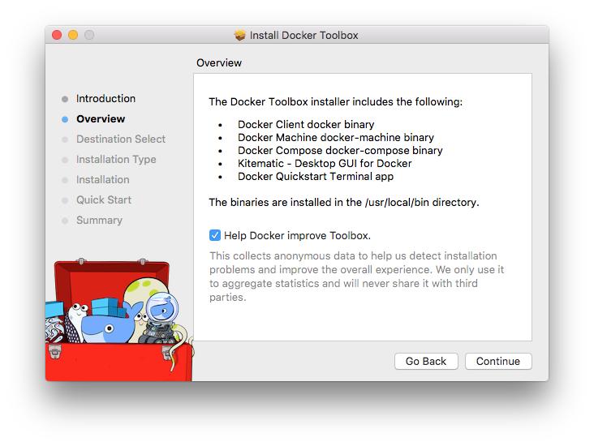

Docker Toolbox is an installer for quick setup and launch of a Docker environment on older Mac and Windows systems that do not meet the requirements of the new [Docker for Mac](/docker-for-mac/index.md) and [Docker for Windows](/docker-for-windows/index.md) apps.

## What's in the box

Toolbox includes these Docker tools:

* Docker Machine for running `docker-machine` commands

* Docker Engine for running the `docker` commands

* Docker Compose for running the `docker-compose` commands

* Kitematic, the Docker GUI

* a shell preconfigured for a Docker command-line environment

* Oracle VirtualBox

You can find various versions of the tools on [Toolbox Releases](https://github.com/docker/toolbox/releases) or run them with the `--version` flag in the terminal, for example, `docker-compose --version`.

## Ready to get started?

1. Get the latest Toolbox installer for your platform:

    <table style="width:100%">
      <tr>
        <th style="font-size: medium; font-family: arial;  text-align: center">
        Toolbox for Mac</th>
        <th style="font-size: medium; font-family: arial; text-align: center">
        Toolbox for Windows</th>
      </tr>
      <tr valign="top">
        <td width="50%" style="font-size: medium; font-family: arial;  text-align: center">
        <a class="button outline-btn" href="https://download.docker.com/mac/stable/DockerToolbox.pkg">Get Docker Toolbox for Mac</a>
        </td>
        <td width="50%" style="font-size: medium; font-family: arial;  text-align: center">
        <a class="button outline-btn" href="https://download.docker.com/win/stable/DockerToolbox.exe">Get Docker Toolbox for Windows</a>
        </td>
      </tr>
    </table>

2. Choose the install instructions for your platform, and follow the steps:

    * [Install Docker Toolbox on macOS](toolbox_install_mac.md)

    * [Install Docker Toolbox for Windows](toolbox_install_windows.md)

## Next steps

* Try the [Get started](/get-started/) tutorial.

* Dig in deeper with [more tutorials and examples](/engine/tutorials/index.md) on building images, running containers, networking, managing data, and storing images on Docker Hub.

* [Learn about Kitematic](/kitematic/userguide.md)

* [Learn about Docker Machine](/machine/overview.md)

* [Learn about Docker Compose](/compose/overview.md)
