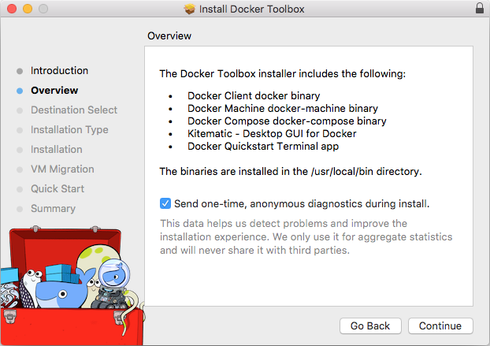
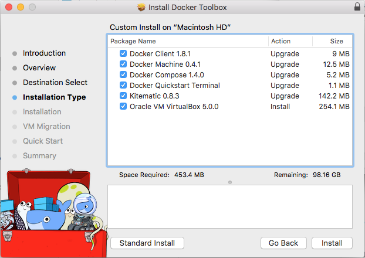
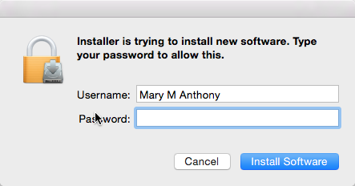
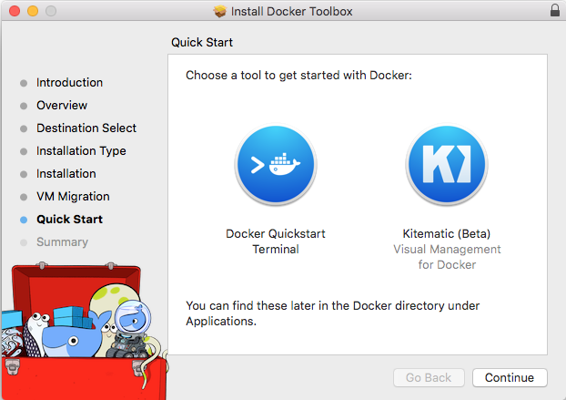
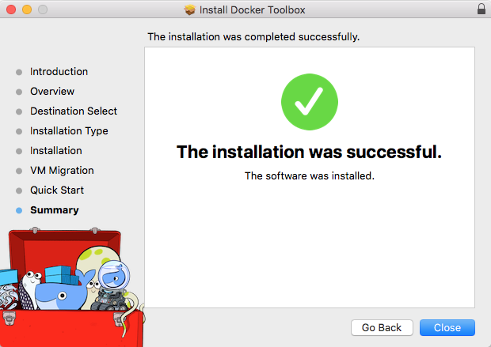
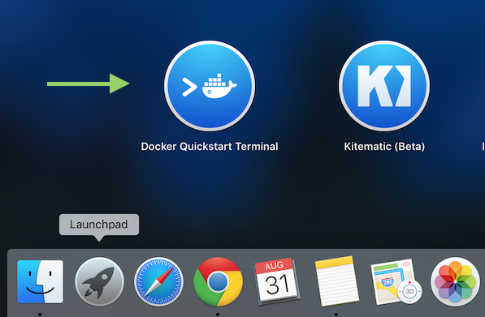
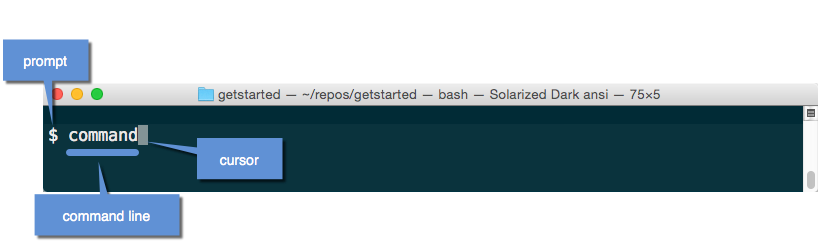

Docker Toolbox provides a way to use Docker on older Macs
that do not meet
minimal system requirements for [Docker for Mac](/docker-for-mac/index.md).

If you have not done so already, download the installer here:

[Get Docker Toolbox for Mac](https://download.docker.com/mac/stable/DockerToolbox.pkg){: class="button outline-btn" }

## What you get and how it works

Docker Toolbox includes the following Docker tools:

* Docker CLI client for running Docker Engine to create images and containers
* Docker Machine so you can run Docker Engine commands from macOS terminals
* Docker Compose for running the `docker-compose` command
* Kitematic, the Docker GUI
* the Docker QuickStart shell preconfigured for a Docker command-line environment
* Oracle VM VirtualBox

Because the Docker Engine daemon uses Linux-specific
kernel features, you can't run Docker Engine natively on
macOS with Docker Toolbox. Instead, you must use the
Docker Machine command, `docker-machine`, to create and
attach to a small Linux VM on your machine. This VM hosts
Docker Engine for you on your Mac.

>**Tip**: One of the advantages of the newer
[Docker for Mac](/docker-for-mac/index.md) solution is that
it uses native virtualization and does not require
VirtualBox to run Docker.


## Step 1: Check your version

Your Mac must be running macOS 10.8 "Mountain Lion" or newer to run Docker
software. To find out what version of the OS you have:

1. Choose **About this Mac** from the Apple menu.

    The version number appears directly below the words `macOS`.

2. If you have the correct version, go to the next step.

    If you aren't using a supported version, you could consider upgrading your
    operating system.

    If you have macOS 10.10.3 Yosemite or newer, consider using [Docker for
    Mac](/docker-for-mac/) instead. It runs natively on the Mac, so there is no
    need for a pre-configured Docker QuickStart shell. It uses the native macOS
    Hypervisor framework for virtualization, instead of Oracle VirutalBox. Full
    install prerequisites are provided in the Docker for Mac topic in [Docker
    for Mac](/docker-for-mac/#what-to-know-before-you-install).

## Step 2: Install Docker Toolbox

1. Install Docker Toolbox by double-clicking the package or by right-clicking
and choosing "Open" from the pop-up menu.

    The installer launches an introductory dialog, followed by an overview of what's installed.

    

2. Press **Continue** to install the toolbox.

    The installer presents you with options to customize the standard
    installation.

    

    By default, the standard Docker Toolbox installation:

    * installs binaries for the Docker tools in `/usr/local/bin`
    * makes these binaries available to all users
    * updates any existing Virtual Box installation

    For now, don't change any of the defaults.

3. Press **Install** to perform the standard installation.

     The system prompts you for your password.

     

4. Provide your password to continue with the installation.

     When it completes, the installer provides you with some shortcuts. You can ignore this for now and click **Continue**.

     

     Then click **Close** to finish the installer.

     


## Step 3: Verify your installation

To run a Docker container, you:

* create a new (or start an existing) Docker Engine host running
* switch your environment to your new VM
* use the `docker` client to create, load, and manage containers

Once you create a machine, you can reuse it as often as you like. Like any
Virtual Box VM, it maintains its configuration between uses.

1. Open the **Launchpad** and locate the Docker Quickstart Terminal icon.

    

2. Click the icon to launch a Docker Quickstart Terminal window.

    The terminal does a number of things to set up Docker Quickstart Terminal for you.

        Last login: Sat Jul 11 20:09:45 on ttys002
        bash '/Applications/Docker Quickstart Terminal.app/Contents/Resources/Scripts/start.sh'
        Get http:///var/run/docker.sock/v1.19/images/json?all=1&filters=%7B%22dangling%22%3A%5B%22true%22%5D%7D: dial unix /var/run/docker.sock: no such file or directory. Are you trying to connect to a TLS-enabled daemon without TLS?
        Get http:///var/run/docker.sock/v1.19/images/json?all=1: dial unix /var/run/docker.sock: no such file or directory. Are you trying to connect to a TLS-enabled daemon without TLS?
        -bash: lolcat: command not found

        mary at meepers in ~
        $ bash '/Applications/Docker Quickstart Terminal.app/Contents/Resources/Scripts/start.sh'
        Creating Machine dev...
        Creating VirtualBox VM...
        Creating SSH key...
        Starting VirtualBox VM...
        Starting VM...
        To see how to connect Docker to this machine, run: docker-machine env dev
        Starting machine dev...
        Setting environment variables for machine dev...

                                ##         .
                          ## ## ##        ==
                       ## ## ## ## ##    ===
                   /"""""""""""""""""\___/ ===
              ~~~ {~~ ~~~~ ~~~ ~~~~ ~~~ ~ /  ===- ~~~
                   \______ o           __/
                     \    \         __/
                      \____\_______/

        The Docker Quick Start Terminal is configured to use Docker with the "default" VM.

3.  Click your mouse in the terminal window to make it active.

    If you aren't familiar with a terminal window, here are some quick tips.

    

    The prompt is traditionally a `$` dollar sign. You type commands into the
    *command line* which is the area after the prompt. Your cursor is indicated
    by a highlighted area or a `|` that appears in the command line. After
    typing a command, always press RETURN.

4. Type the `docker run hello-world` command and press RETURN.

    The command does some work for you, if everything runs well, the command's
    output looks like this:

        $ docker run hello-world
        Unable to find image 'hello-world:latest' locally
        latest: Pulling from library/hello-world
        535020c3e8ad: Pull complete
        af340544ed62: Pull complete
        Digest: sha256:a68868bfe696c00866942e8f5ca39e3e31b79c1e50feaee4ce5e28df2f051d5c
        Status: Downloaded newer image for hello-world:latest

        Hello from Docker.
        This message shows that your installation appears to be working correctly.

        To generate this message, Docker took the following steps:
        1. The Docker Engine CLI client contacted the Docker Engine daemon.
        2. The Docker Engine daemon pulled the "hello-world" image from the Docker Hub.
        3. The Docker Engine daemon created a new container from that image which runs the
           executable that produces the output you are currently reading.
        4. The Docker Engine daemon streamed that output to the Docker Engine CLI client, which sent it
           to your terminal.

        To try something more ambitious, you can run an Ubuntu container with:
        $ docker run -it ubuntu bash

        Share images, automate workflows, and more with a free Docker Hub account:
        https://hub.docker.com

        For more examples and ideas, visit:
        https://docs.docker.com/userguide/

## How to uninstall Toolbox

Removing Toolbox involves removing all the Docker components it includes.

A full uninstall also includes removing the local and remote machines you created with Docker Machine. In some cases, you might want to keep machines created with Docker Machine.

For example, if you plan to re-install Docker Machine as a part of Docker for Mac you can continue to manage those machines through Docker. Or, if you have remote machines on a cloud provider and you plan to manage them using the provider, you wouldn't want to remove them. So the step to remove machines is described here as optional.

To uninstall Toolbox on a Mac, do the following:

1.  List your machines.

    ```
    $ docker-machine ls
    NAME                ACTIVE   DRIVER       STATE     URL                        SWARM
    dev                 *        virtualbox   Running   tcp://192.168.99.100:2376
    my-docker-machine            virtualbox   Stopped
    default                      virtualbox   Stopped
    ```

2.  Optionally, remove each machine. For example:

    ```
    $ docker-machine rm my-docker-machine
    Successfully removed my-docker-machine
    ```

    This step is optional because if you plan
    to re-install Docker Machine as a part
    of [Docker for Mac](/docker-for-mac/index.md), you can import and
    continue to manage those machines through Docker.

3.  Remove the Docker Quickstart Terminal and Kitematic from your "Applications" folder.

4.  Run the following in a command shell to fully remove Kitematic:

    ```
    rm -fr ~/Library/Application\ Support/Kitematic
    ```

5.  Remove the `docker`, `docker-compose`, and `docker-machine` commands from the `/usr/local/bin` folder.

    ```
    $ rm /usr/local/bin/docker
    $ rm /usr/local/bin/docker-compose
    $ rm /usr/local/bin/docker-machine
    ```

6. Optionally, remove the `~/.docker` directory.

    If you want to remove Docker entirely, you
    can remove the `~/.docker` directory
    recursively. This directory stores some
    Docker program configuration and/or state
    (e.g., information about created machines such
    as certificates). Removing this directory
    is typically not necessary.


7. Uninstall Oracle VirtualBox, which is
installed as a part of the Toolbox install.

## Next steps

* Try the [Get started](/get-started/) tutorial.

* Dig in deeper with [more tutorials and examples](/engine/tutorials/index.md) on building images, running containers, networking, managing data, and storing images on Docker Hub.

* [Learn about Kitematic](/kitematic/userguide.md)

* [Learn about Docker Machine](/machine/overview.md)

* [Learn about Docker Compose](/compose/overview.md)
