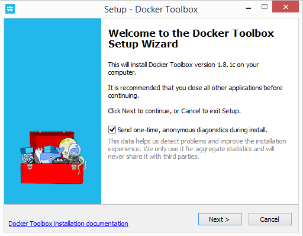

Docker Toolbox provides a way to use Docker on Windows systems that do not meet
minimal system requirements for the [Docker Desktop for Windows](../docker-for-windows/index.md)
app.

## What you get and how it works

Docker Toolbox includes the following Docker tools:

* Docker CLI client for running Docker Engine to create images and containers
* Docker Machine so you can run Docker Engine commands from Windows terminals
* Docker Compose for running the `docker-compose` command
* Kitematic, the Docker GUI
* the Docker QuickStart shell preconfigured for a Docker command-line environment
* Oracle VM VirtualBox

Because the Docker Engine daemon uses Linux-specific
kernel features, you can't run Docker Engine natively
on Windows. Instead, you must use the Docker Machine
command, `docker-machine`, to create and attach to a
small Linux VM on your machine. This VM hosts Docker Engine
for you on your Windows system.

>**Tip**: One of the advantages of the newer
[Docker Desktop for Windows](../docker-for-windows/index.md) solution is that
it uses native virtualization and does not require
VirtualBox to run Docker.

## Step 1: Check your version

To run Docker, your machine must have a 64-bit operating system running Windows 7 or higher. Additionally, you must make sure that virtualization is enabled on your machine.
To verify your machine meets these requirements, do the following:

1. Right click the windows message and choose **System**.

    If you aren't using a supported version, you could consider upgrading your
  operating system.

    If you have a newer system, specifically 64bit Windows 10 Pro, with
    Enterprise and Education (1607 Anniversary update, Build 14393 or later),
    consider using [Docker Desktop for Windows](/docker-for-windows) instead. It runs
    natively on the Windows, so there is no need for a pre-configured Docker
    QuickStart shell. It also uses Hyper-V for virtualization, so the
    instructions below for checking virtualization will be out of date for newer
    Windows systems. Full install prerequisites are provided in the Docker Desktop for
    Windows topic in [What to know before you
    install](/docker-for-windows/#what-to-know-before-you-install).

2.  Make sure your Windows system supports Hardware Virtualization Technology and that virtualization is enabled.

    <br>
    **For Windows 10**
    
    Run [Speccy](https://www.piriform.com/speccy){: target="_blank" class="_"}, and look at the CPU information.    
    
    <br>
    **For Windows 8 or 8.1**

    Choose **Start > Task Manager** and navigate to the **Performance** tab.
	  Under **CPU** you should see the following:

    

    If virtualization is not enabled on your system, follow the manufacturer's instructions for enabling it.

    <br>
    **For Windows 7**

    Run a tool like the [Microsoft® Hardware-Assisted Virtualization Detection Tool](http://www.microsoft.com/en-us/download/details.aspx?id=592){: target="_blank" class="_"} or [Speccy](https://www.piriform.com/speccy){: target="_blank" class="_"}, and follow the on-screen instructions.
    <br><br>
3. Verify your Windows OS is 64-bit (x64)

   How you do this verification depends on your Windows version.  
   For details, see the Windows article [How to determine whether
   a computer is running a 32-bit version or 64-bit version of the
   Windows operating system](https://support.microsoft.com/en-us/kb/827218).

## Step 2: Install Docker Toolbox

In this section, you install the Docker Toolbox software and several "helper" applications. The installation adds the following software to your machine:

* Docker Client for Windows
* Docker Toolbox management tool and ISO
* Oracle VM VirtualBox
* Git MSYS-git UNIX tools

If you have a previous version of VirtualBox installed, do not reinstall it with the Docker Toolbox installer. When prompted, uncheck it.

If you have Virtual Box running, you must shut it down before running the
installer.

> **Note**: Docker no longer maintains the download.docker.com url for
> Docker Toolbox, therefore an unsigned warning (verified publisher dialog) is
> displayed during the installation process. 

1. To download the latest version of Docker Toolbox, go to [Toolbox
   Releases](https://github.com/docker/toolbox/releases) and download the
   latest `.exe` file.

2. Install Docker Toolbox by double-clicking the installer.

    The installer launches the "Setup - Docker Toolbox" dialog.

    If Windows security dialog prompts you to allow the program to make a
    change, choose **Yes**. The system displays the **Setup - Docker Toolbox for
    Windows** wizard.

      

3. Press **Next** to accept all the defaults and then **Install**.

	  Accept all the installer defaults. The installer takes a few minutes to install all the components:

4.  When notified by Windows Security the installer will make changes, make sure you allow the installer to make the necessary changes.

    When it completes, the installer reports it was successful:

    

5. Uncheck "View Shortcuts in File Explorer" and press **Finish**.


## Step 3: Verify your installation

The installer adds Docker Toolbox, VirtualBox, and Kitematic to your
**Applications** folder. In this step, you start Docker Toolbox and run a simple
Docker command.

1. On your Desktop, find the Docker QuickStart Terminal icon.

    

2. Click the Docker QuickStart icon to launch a pre-configured Docker Toolbox terminal.

    If the system displays a **User Account Control** prompt to allow VirtualBox to make changes to your computer. Choose **Yes**.

    The terminal does several things to set up Docker Toolbox for you. When it is done, the terminal displays the `$` prompt.

     

    The terminal runs a special `bash` environment instead of the standard Windows command prompt. The `bash` environment is required by Docker.

3.  Make the terminal active by clicking your mouse next to the `$` prompt.

    If you aren't familiar with a terminal window, here are some quick tips.

    

    The prompt is traditionally a `$` dollar sign. You type commands into the
    *command line* which is the area after the prompt. Your cursor is indicated
    by a highlighted area or a `|` that appears in the command line. After
    typing a command, always press RETURN.

4. Type the `docker run hello-world` command and press RETURN.

    The command does some work for you, if everything runs well, the command's
    output looks like this:

        $ docker run hello-world
        Unable to find image 'hello-world:latest' locally
        Pulling repository hello-world
        91c95931e552: Download complete
        a8219747be10: Download complete
        Status: Downloaded newer image for hello-world:latest
        Hello from Docker.
        This message shows that your installation appears to be working correctly.

        To generate this message, Docker took the following steps:
         1. The Docker Engine CLI client contacted the Docker Engine daemon.
         2. The Docker Engine daemon pulled the "hello-world" image from the Docker Hub.
            (Assuming it was not already locally available.)
         3. The Docker Engine daemon created a new container from that image which runs the
            executable that produces the output you are currently reading.
         4. The Docker Engine daemon streamed that output to the Docker Engine CLI client, which sent it
            to your terminal.

        To try something more ambitious, you can run an Ubuntu container with:
         $ docker run -it ubuntu bash

        For more examples and ideas, visit:
         https://docs.docker.com/userguide/

## Looking for troubleshooting help?

Typically, the above steps work out-of-the-box, but some scenarios can cause problems. If your `docker run hello-world` didn't work and resulted in errors, check out [Troubleshooting](faqs/troubleshoot.md) for quick fixes to common problems.

A Windows specific problem you might encounter relates to the NDIS6 host network filter driver, which is known to cause issues on some Windows
versions. For Windows Vista systems and newer, VirtualBox installs NDIS6 driver by default. Issues can range from system slowdowns to networking problems for the virtual machine (VM). If you notice problems, **re-run the Docker Toolbox installer**, and select the option to _**install VirtualBox with the NDIS5 driver**_.

## Optional: Add shared directories

By default, Toolbox only has access to the `C:\Users` directory and mounts it into
the VMs at `/c/Users`.

> **Note**: Within the VM path, `c` is lowercase and the `Users` is capitalized.

If your project lives elsewhere or needs access to other
directories on the host filesystem, you can add them, using the VirtualBox UI.

1.  Open the VirtualBox UI.

2.  Click the **Settings** gear, then go to **Shared Folders**.

3.  Select any existing listing under **Machine Folders**, then
    click the **+** icon.

    * Choose the **Folder Path** on the host, enter the **Folder Name**
      for within the VM (or take the default, which is the same name
      as on the host), and configure any additional options you need.

    * Choose **Auto-mount** if you want the folder to automatically
      be mounted into the VM, and choose **Make Permanent** for it
      to be considered a permanently shared folder.

4.  Click **OK** to add the new folder to the Shared Folders list.

5.  Click **OK** again to save your changes and exit the Settings dialog.

## How to uninstall Toolbox

Removing Toolbox involves removing all the Docker components it includes.

A full uninstall also includes removing the local and remote machines you created with Docker Machine. In some cases, you might want to keep machines created with Docker Machine.

For example, if you plan to re-install Docker Machine as a part of Docker Desktop for Windows you can continue to manage those machines through Docker. Or, if you have remote machines on a cloud provider and you plan to manage them using the provider, you wouldn't want to remove them. So the step to remove machines is described here as optional.

To uninstall Toolbox on Windows, do the following:

1.  List your machines.

    ```
    $ docker-machine ls
    NAME                ACTIVE   DRIVER       STATE     URL                        SWARM
    dev                 *        virtualbox   Running   tcp://192.168.99.100:2376
    my-docker-machine            virtualbox   Stopped
    default                      virtualbox   Stopped
    ```

2.  Optionally, remove each machine. For example:

    ```
    $ docker-machine rm my-docker-machine
    Successfully removed my-docker-machine
    ```

    This step is optional because if you plan to re-install Docker Machine as a
    part of [Docker Desktop for Windows](../docker-for-windows/index.md), you can
    import and continue to manage those machines through Docker.

3. Uninstall Docker Toolbox using Window's standard process for uninstalling programs through the control panel (programs and features).

    >**Note**: This process does not remove the `docker-install.exe` file. You must delete that file yourself.

5. Optionally, remove the
`C:\Users\<your-user>\.docker` directory.

    If you want to remove Docker entirely, you
    can verify that the uninstall removed
    the `.docker` directory under your user path.
    If it is still there, remove it manually.
    This directory stores some Docker
    program configuration and state, such as
    information about created machines and
    certificates. You usually don't need to remove this directory.

6. Uninstall Oracle VirtualBox, which is
  installed as a part of the Toolbox install.

## Next steps

* Try out the [Get started](../get-started/index.md) tutorial.

* Dig in deeper with [more tutorials and examples](../engine/tutorials/index.md) on building images, running containers, networking, managing data, and storing images on Docker Hub.

* [Learn about Kitematic](../kitematic/userguide.md)

* [Learn about Docker Machine](../machine/overview.md)

* [Learn about Docker Compose](../compose/index.md)
